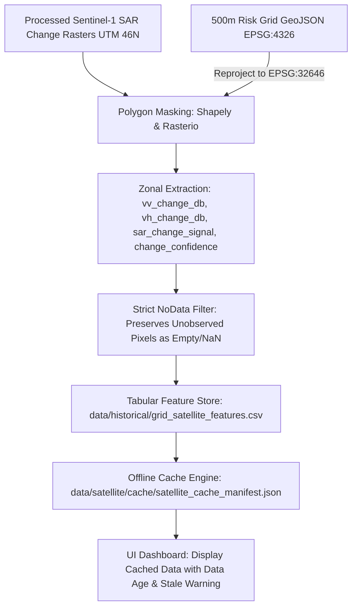

# STEP 7 — Phase C: SAR to 500m Risk Grid Aggregation & Offline Architecture

## 1. Executive Summary

This document specifies the methodology, spatial transformations, data schema, and offline-first cache architecture for **Phase C of STEP 7: SAR to 500m Grid Aggregation** within the **NER Safe** early warning system.

The pipeline bridges continuous high-resolution Sentinel-1 SAR change rasters with the discrete **500 m × 500 m hexagonal/orthogonal regional risk grid** established in STEP 2.



---

## 2. Spatial Scale & Scientific Distinction

> [!IMPORTANT]
> **Spatial Resolution vs. Zonal Aggregation Distinction**
> The 500 m regional risk grid is an **analytical management unit**, NOT a satellite sensor measurement resolution.
> - **Sentinel-1 GRDH native spatial resolution**: ~20 m × 22 m (10 m pixel spacing).
> - **Grid cell aggregation**: Each 500 m × 500 m cell covers approximately $250,000\text{ m}^2$, encompassing approximately **278 underlying 30 m terrain-corrected pixels**.
> - The values assigned to each grid cell represent **zonal statistics** (areal averages of valid pixels).
> - Aggregating to 500 m does **not** grant the satellite 500 m measurement resolution, nor does it eliminate sub-pixel localized terrain features.

---

## 3. Zonal Statistics Aggregation Methodology

### 3.1 Input Raster Specifications

| Property | Requirement |
| :--- | :--- |
| **Coordinate Reference System (CRS)** | EPSG:32646 (WGS 84 / UTM Zone 46N) |
| **Pixel Spacing** | 30.0 m × 30.0 m (metric grid aligned with Copernicus DEM) |
| **NoData Value** | `-9999.0` (Float32) |
| **Core Bands** | 1. `vv_change_db` (dB backscatter difference)<br>2. `vh_change_db` (dB backscatter difference)<br>3. `sar_change_signal` (Euclidean vector magnitude)<br>4. `change_confidence` (Normalized $[0.0, 1.0]$ index) |

### 3.2 Polygon Extraction Algorithm
For each grid cell polygon $P_k$:
1. Transform polygon coordinates from EPSG:4326 to EPSG:32646 using `pyproj.Transformer`.
2. Extract the intersecting raster window using `rasterio.mask.mask(crop=True)`.
3. Filter out NoData pixels ($z \ne -9999.0$ and $\text{isfinite}(z)$).
4. If valid pixels $N_v > 0$, compute the arithmetic mean:
   $$\bar{z}_k = \frac{1}{N_v} \sum_{i=1}^{N_v} z_i$$
5. If $N_v = 0$ (cell is outside the SAR swath, obscured by severe radar shadow, or unobserved), assign **`None` / empty string**.

### 3.3 Strict NoData Preservation Rules
- **No Zero-Imputation**: Missing SAR values must **never** be replaced with `0.0`. A value of $0.0\text{ dB}$ represents *zero change between passes* (identical backscatter), which is a physical measurement, not an absence of data.
- **No Mean/Median Imputation**: Unobserved cells must never be populated with regional averages.
- **No Synthetic Placeholders**: Missing passes remain blank to signal to emergency managers that no recent radar snapshot was acquired.

---

## 4. Tabular Feature Schema

Tabular outputs are stored at [`data/historical/grid_satellite_features.csv`](file:///c:/Users/sambi/Downloads/SIH%2026/data/historical/grid_satellite_features.csv):

| Column Name | Data Type | Units / Range | Description | Example |
| :--- | :--- | :--- | :--- | :--- |
| `cell_id` | String | Unique ID | Grid cell identifier from district boundary | `KOH_00124` |
| `district` | String | Name | Administrative district | `Kohima` |
| `observation_date` | String | ISO 8601 | Acquisition date of the post-event pass | `2025-07-13` |
| `vv_change_db` | Float | $-50.0$ to $+50.0\text{ dB}$ | Zonal mean VV decibel change | `+3.42` |
| `vh_change_db` | Float | $-50.0$ to $+50.0\text{ dB}$ | Zonal mean VH decibel change | `+1.85` |
| `sar_change_signal` | Float | $\ge 0.0\text{ dB}$ | Multi-pol Euclidean anomaly magnitude | `3.89` |
| `change_confidence` | Float | $0.0$ to $1.0$ | Sigmoid disturbance strength index | `0.74` |
| `data_source` | String | Categorical | Sensor and platform provenance | `Sentinel-1A IW GRD` |

> [!NOTE]
> **Multi-Temporal Handling**: If multiple repeat-pass acquisitions cover a grid cell across different dates, each observation is preserved as an individual row keyed by `(cell_id, observation_date)`. Rows are never overwritten.

---

## 5. Offline-First & Low-Bandwidth Architecture

Hilly terrains in Nagaland and Mizoram frequently suffer telecom infrastructure outages during monsoon downpours and landslides. The NER Safe platform is architected for **offline-first survivability**:

### 5.1 Local Cache Manifest
Maintained at [`data/satellite/cache/satellite_cache_manifest.json`](file:///c:/Users/sambi/Downloads/SIH%2026/data/satellite/cache/satellite_cache_manifest.json):
```json
{
  "metadata": {
    "project": "NER Safe (SIH 2026)",
    "pipeline_step": "STEP 7 — Satellite Data Pipeline",
    "last_sync_utc": "2026-09-16T19:42:28.499701+00:00",
    "status": "PENDING_REAL_SCENES",
    "offline_mode_ready": true
  },
  "data_summary": {
    "total_observations_recorded": 0,
    "latest_observation_date": null,
    "data_age_days": null,
    "cache_status_label": "PENDING_REAL_SCENE_INGESTION",
    "user_facing_notice": "Sentinel-1 SAR observations reflect cached snapshot passes. Never display as live real-time radar feed. Corroborating anomaly metric only."
  }
}
```

### 5.2 UI Presentation & Transparency Rules
1. **Never Present Cached Data as Live**: The dashboard must explicitly display:
   - Observation timestamp (e.g., `"Acquired: 2025-07-13 11:48 UTC"`)
   - Time elapsed / Data Age (e.g., `"Data age: 4 days old"`)
   - Last synchronization time (e.g., `"Last sync: 2 hours ago"`)
2. **Staleness Categorization**:
   - **`CACHED_RECENT`** ($\le 14$ days): Valid corroborating background context.
   - **`CACHED_STALE`** ($> 14$ days): Visual indicator turns amber/gray to warn responders that recent surface conditions may have shifted.
   - **`PENDING_REAL_SCENE_INGESTION`**: Initial system state before raw scene download.

---

## 6. Current Pipeline Status & Anti-Fabrication Verification

| Metric | Status | Verification Detail |
| :--- | :--- | :--- |
| **Catalog Granules** | 500 records | Real ASF DAAC holdings (250 Kohima, 250 Aizawl) |
| **Local Raw Scenes Downloaded** | 0 scenes | No large .zip archives downloaded |
| **Synthetic/Fabricated Rows** | 0 rows | Tabular target initialized with header schema only |
| **Grid Cell Geometric Integrity** | 16,961 cells | Kohima: 6,055 cells; Aizawl: 10,906 cells verified |
| **Automated Validation Suite** | 14 / 14 PASSED | `scripts/validate_satellite_data.py` exited code 0 |

---

## 7. Execution Commands

### Run Grid Aggregation (Safe / Dry-Run Mode):
```bash
python scripts/assign_grid_satellite.py --dry-run
```

### Run Full Satellite Data Validation Suite:
```bash
python scripts/validate_satellite_data.py
```
