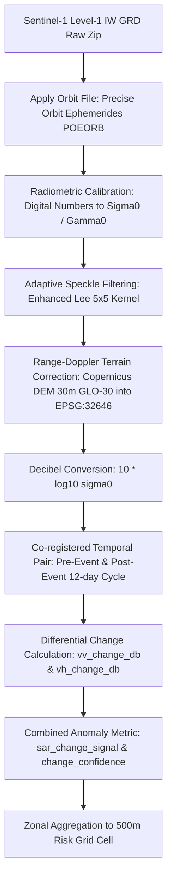

# STEP 7 — Phase B: Sentinel-1 SAR Change Processing Pipeline

## 1. Overview & Objectives

This document establishes the scientific methodology, algorithmic architecture, and software dependencies for **Phase B of STEP 7: Sentinel-1 Synthetic Aperture Radar (SAR) Change Processing** within the **NER Safe** platform.

The objective is to ingest repeat-pass Sentinel-1 C-band SAR scenes over the pilot districts (**Kohima District, Nagaland** and **Aizawl District, Mizoram**), extract radiometric backscatter changes across consecutive acquisitions, and produce structured anomaly metrics that corroborate dynamic landslide risk assessment.

> [!IMPORTANT]
> **Core Scientific Rule: SAR Change Is Corroborating Evidence, Not Automatic Landslide Detection**
> A SAR backscatter shift indicates an alteration in surface dielectric constant (moisture), surface roughness, or geometric structure. While slope failures and scarp formations produce pronounced SAR changes, so do severe rainstorms, crop harvesting, seasonal phenology, and road maintenance.
> 
> Therefore, SAR change outputs are strictly named:
> - `sar_change_signal` (Euclidean multi-polarization backscatter shift)
> - `vv_change_db` (VV polarization difference in decibels)
> - `vh_change_db` (VH polarization difference in decibels)
> - `change_confidence` (Normalized anomaly intensity index)
> 
> The system **never** outputs binary declarations such as `landslide_detected = true` from SAR data alone.

---

## 2. Satellite Remote Sensing Product

| Parameter | Specification |
| :--- | :--- |
| **Constellation** | Copernicus Sentinel-1 (Sentinel-1A, 1C, 1D) |
| **Sensor** | C-band Synthetic Aperture Radar (C-SAR, central frequency 5.405 GHz) |
| **Acquisition Mode** | Interferometric Wide (IW) Swath |
| **Product Type** | Ground Range Detected High-Resolution (GRD_HD / Level-1) |
| **Polarization** | Dual-polarization: VV (co-polarized) + VH (cross-polarized) |
| **Nominal Spatial Resolution** | 20 m × 22 m (range × azimuth) |
| **Pixel Spacing** | 10 m × 10 m |
| **Swath Width** | 250 km |
| **Equivalent Number of Looks (ENL)** | ~4.4 looks |
| **Radiometric Accuracy** | 1 dB (3σ) |
| **Orbit Repeat Cycle** | 12 days (single satellite) / 6 days (two-satellite constellation) |

---

## 3. End-to-End Processing Chain

The processing pipeline transforms raw Level-1 GRD archives into analysis-ready backscatter change rasters aligned with the regional UTM Zone 46N (EPSG:32646) grid.



### 3.1 Step 1: Input Validation & Orbit Compatibility
To avoid false change signals caused by baseline differences, scene pairs must share:
- **Identical Platform & Mode**: Sentinel-1 IW GRDH
- **Identical Relative Orbit**: Same track number
- **Identical Flight Direction**: Ascending or Descending
- **Identical Frame Number**: Overlapping ground footprint
- **Identical Polarization**: Dual-pol VV+VH

### 3.2 Step 2: Precise Orbit Application
Applies Precise Orbit Ephemerides (`.EOF` files published by ESA ~20 days post-acquisition) or Restitution Orbit files (`.RESORB` published within 3 hours) to ensure sub-pixel geodetic accuracy.

### 3.3 Step 3: Radiometric Calibration
Converts uncalibrated digital pixel values ($DN_i$) to physically meaningful radar cross-sections ($\sigma^0$ or $\gamma^0$):

$$\sigma^0_i = \frac{DN_i^2}{A_i^2}$$

where $A_i$ is the calibration factor provided in the Sentinel-1 XML calibration LUT.

### 3.4 Step 4: Adaptive Speckle Filtering (Enhanced Lee Filter)
Multiplicative SAR speckle is suppressed using the **Enhanced Lee** adaptive spatial filter (Lopes et al., 1990) over a $5 \times 5$ moving window:

$$R = \bar{I} + W \cdot (I - \bar{I})$$

where:
- $\bar{I}$ is the local moving mean, $I$ is the center pixel intensity.
- $C_i = \frac{\sigma_I}{\bar{I}}$ is the local coefficient of variation.
- $C_u = \frac{1}{\sqrt{N_{\text{looks}}}} \approx \frac{1}{\sqrt{4.4}} \approx 0.476$ (noise coefficient).
- $C_{\text{max}} = \sqrt{2} \cdot C_u \approx 0.673$ (point target threshold).
- Weight factor $W$:
  - If $C_i \le C_u$: $W = 0$ (homogeneous area; full smoothing).
  - If $C_u < C_i < C_{\text{max}}$: $W = \exp\left(-\frac{k(C_i - C_u)}{C_{\text{max}} - C_i}\right)$ (adaptive smoothing).
  - If $C_i \ge C_{\text{max}}$: $W = 1$ (heterogeneous/edge area; unfiltered preservation).

### 3.5 Step 5: Range-Doppler Terrain Correction & Geocoding
Corrects for side-looking radar distortions (foreshortening, layover, shadow) using the high-resolution **Copernicus DEM 30m (GLO-30)** established in STEP 6:
- Output projection: **UTM Zone 46N (EPSG:32646)**
- Resampling: Bilinear interpolation
- Metric pixel resolution: 30 m × 30 m

### 3.6 Step 6: Logarithmic (dB) Conversion
Radar backscatter is expressed on the decibel (dB) scale:

$$\sigma^0_{\text{dB}} = 10 \cdot \log_{10}(\sigma^0)$$

Typical terrestrial values range from $-25\text{ dB}$ (smooth water / specular reflection) to $0\text{ dB}$ (intense corner reflectors / urban surfaces).

---

## 4. Multi-Polarization Backscatter & Change Formulation

### 4.1 Physical Roles of VV and VH Channels

| Channel | Interaction Mechanism | Landslide-Relevant Sensitivity |
| :--- | :--- | :--- |
| **VV (Vertical-Transmit, Vertical-Receive)** | Direct surface scattering, specular roughness, dielectric shifts. | Highly sensitive to sudden moisture changes, scarp exposure, and soil saturation. |
| **VH (Vertical-Transmit, Horizontal-Receive)** | Cross-polarized volume scattering from canopies and vegetation structures. | Highly sensitive to canopy destruction, de-vegetation, and structural slope displacement. |

### 4.2 Differential Change Metrics

For a pre-event acquisition ($T_1$) and post-event acquisition ($T_2$):

#### 1. VV Change in Decibels
$$\Delta \text{VV}_{\text{dB}} = \text{VV}_{\text{dB}}(T_2) - \text{VV}_{\text{dB}}(T_1) = 10 \cdot \log_{10}\left(\frac{\sigma^0_{\text{VV}}(T_2)}{\sigma^0_{\text{VV}}(T_1)}\right)$$

#### 2. VH Change in Decibels
$$\Delta \text{VH}_{\text{dB}} = \text{VH}_{\text{dB}}(T_2) - \text{VH}_{\text{dB}}(T_1) = 10 \cdot \log_{10}\left(\frac{\sigma^0_{\text{VH}}(T_2)}{\sigma^0_{\text{VH}}(T_1)}\right)$$

#### 3. Combined SAR Change Signal (`sar_change_signal`)
The multi-polarization Euclidean disturbance vector:

$$\text{sar\_change\_signal} = \sqrt{(\Delta \text{VV}_{\text{dB}})^2 + (\Delta \text{VH}_{\text{dB}})^2}$$

#### 4. Change Confidence (`change_confidence`)
A normalized $[0.0, 1.0]$ sigmoid index centered around the empirical $3.0\text{ dB}$ disturbance threshold:

$$\text{change\_confidence} = \frac{1}{1 + \exp\left(-1.2 \cdot (\text{sar\_change\_signal} - 3.0)\right)}$$

- Values $< 0.25$: Sub-threshold background variation / phenological noise.
- Values $0.25 - 0.70$: Moderate surface backscatter anomaly.
- Values $> 0.70$: Significant surface alteration requiring field/officer inspection.

---

## 5. Software & Dependency Architecture

### 5.1 Python Scientific Stack (Active & Available)
- **`rasterio` (v1.5.1)**: GeoTIFF I/O, georeferencing, windowed reading, coordinate transforms.
- **`numpy` (v2.5.3)**: High-performance vectorized array calculations for calibration and dB conversion.
- **`scipy`**: Spatial convolution (`scipy.ndimage`) for adaptive Enhanced Lee speckle filtering.

### 5.2 Level-1 Raw Ingestion (ESA SNAP GPT)
- **Tool**: European Space Agency S-1 Toolbox / Graph Processing Tool (`gpt.exe`).
- **Status on Current Host**: **Not Installed**.
- **Role**: Handles raw `.SAFE.zip` unpacking, automatic orbit ephemeris download (`POEORB`), Doppler Range equations, and Level-1 calibration graphs.
- **Integration**: `scripts/process_sar_change.py` contains automated Graph XML generation (`build_snap_graph_xml()`) and can invoke `gpt` whenever installed or supplied via `--snap-path`.

---

## 6. Curated Repeat-Pass Test Strategy

To ensure reproducible testing without downloading hundreds of gigabytes, a small, high-quality test set of **2 consecutive repeat-pass acquisitions per district** (4 scenes total) has been selected from `sentinel1_catalog.json`:

### 6.1 Kohima District (Nagaland)
- **Platform**: Sentinel-1A
- **Relative Orbit**: 143 (Ascending pass)
- **Frame Number**: 81
- **Polarization**: VV+VH
- **Repeat Interval**: **12 days** (Consecutive cycle)
- **Pre-Event Scene**:
  - Name: `S1A_IW_GRDH_1SDV_20250701T114900_20250701T114925_059890_077066_962D`
  - Acquisition: 2025-07-01 (1016.15 MB)
- **Post-Event Scene**:
  - Name: `S1A_IW_GRDH_1SDV_20250713T114859_20250713T114924_060065_077667_602A`
  - Acquisition: 2025-07-13 (1014.38 MB)

### 6.2 Aizawl District (Mizoram)
- **Platform**: Sentinel-1A
- **Relative Orbit**: 77 (Descending pass)
- **Frame Number**: 513
- **Polarization**: VV+VH
- **Repeat Interval**: **12 days** (Consecutive cycle)
- **Pre-Event Scene**:
  - Name: `S1A_IW_GRDH_1SDV_20250918T234755_20250918T234820_061049_079BA3_84D4`
  - Acquisition: 2025-09-18 (1026.72 MB)
- **Post-Event Scene**:
  - Name: `S1A_IW_GRDH_1SDV_20250930T234755_20250930T234820_061224_07A2B5_60D9`
  - Acquisition: 2025-09-30 (1027.45 MB)

---

## 7. Data Access Requirements & Execution Commands

### 7.1 Authentication Requirements
- Catalog querying is public and requires **no authentication**.
- Scene `.zip` file download requires a free **NASA Earthdata Login**:
  - Registration: [https://urs.earthdata.nasa.gov/](https://urs.earthdata.nasa.gov/)
  - Credential placement: `~/.netrc` (Linux/Mac) or `~/_netrc` (Windows), or environment variables `EARTHDATA_USERNAME` and `EARTHDATA_PASSWORD`.

### 7.2 CLI Commands

#### Diagnostic & Test Pair Inspection (Dry-Run):
```bash
python scripts/process_sar_change.py --dry-run
```

#### Test Set Verification by District:
```bash
python scripts/process_sar_change.py --test --district Kohima --dry-run
python scripts/process_sar_change.py --test --district Aizawl --dry-run
```

#### Download Curated Test Scenes (when credentials configured):
```bash
python scripts/download_sentinel1.py --download --start 2025-07-01 --end 2025-07-15
```

---

## 8. Physical Limitations of SAR in Northeast India

1. **C-Band Penetration Constraints**: Sentinel-1 operates at C-band ($\lambda \approx 5.6\text{ cm}$). In dense evergreen subtropical rainforests (characteristic of Kohima and Aizawl), C-band backscatter reflects primarily from the upper tree canopy and cannot penetrate to the ground surface.
2. **Terrain Distortion in Steep Relief**: Steep slopes cause foreshortening and layover on slopes facing the radar antenna, and radar shadow on slopes facing away. Masking layover/shadow zones using DEM aspect is critical.
3. **Moisture vs. Structural Ambiguity**: High rainfall immediately elevates soil dielectric constants, causing an increase in backscatter that mimics surface roughness changes. SAR must be interpreted in conjunction with dynamic IMD rainfall and SMAP soil moisture data.

---

## 9. References

- Lopes, A., Touzi, R., & Nezry, E. (1990). Adaptive speckle filters and scene heterogeneity. *IEEE Transactions on Geoscience and Remote Sensing*, 28(6), 992–1000.
- European Space Agency (ESA). Sentinel-1 User Handbook. GMES-S1OP-EOPG-TN-13-0001.
- Mondini, A. C., et al. (2019). Measures of SAR backscatter change for landslide detection. *Remote Sensing of Environment*, 235, 111440.
