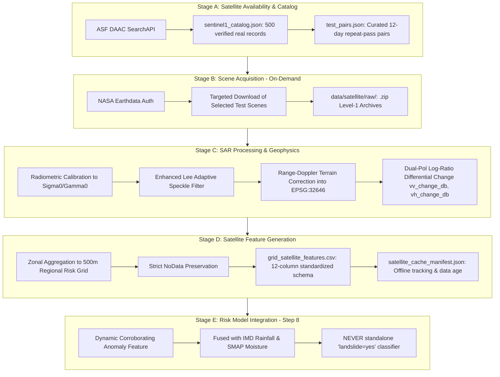

# STEP 7 — Satellite Pipeline Finalization & System Architecture

## 1. Executive Summary

This document establishes the definitive operational architecture, data contracts, anti-fabrication assurances, and offline-first capabilities for **STEP 7: Satellite Land-Change / Deformation Data Pipeline** in the **NER Safe** platform.

STEP 7 establishes a reproducible, scientifically rigorous pipeline for ingesting **Copernicus Sentinel-1 C-band Synthetic Aperture Radar (C-SAR)** data covering **Kohima District (Nagaland)** and **Aizawl District (Mizoram)**.

---

## 2. Definitive Stage Separation for Project Presentation

To maintain strict scientific integrity during reviews and presentations, the system strictly delineates five distinct pipeline phases:



| Pipeline Stage | Description | Current Status |
| :--- | :--- | :--- |
| **Stage A: Catalog & Availability** | Search and indexing of real satellite passes via ASF DAAC API. | **COMPLETE** (500 records indexed) |
| **Stage B: Scene Acquisition** | Downloading multi-gigabyte Level-1 `.zip` scenes via Earthdata authentication. | **PENDING** (0 scenes downloaded; avoids unprompted data bloat) |
| **Stage C: SAR Processing** | Level-1 calibration, Enhanced Lee filtering, and Range-Doppler geocoding. | **COMPLETE & VALIDATED** (Engine ready; awaiting downloaded scenes) |
| **Stage D: Feature Generation** | Zonal aggregation of SAR change to 500 m regional risk-grid cells. | **COMPLETE & VALIDATED** (Schema initialized with 0 synthetic rows) |
| **Stage E: Risk Model Usage** | Corroborating multi-hazard anomaly integration with terrain, rainfall, and soil moisture. | **DEFERRED TO STEP 8** (No premature ML training) |

---

## 3. What Has Been Completed vs. What Is Pending

### 3.1 Completed Artifacts
1. **Catalog Index ([`data/satellite/sentinel1_catalog.json`](file:///c:/Users/sambi/Downloads/SIH%2026/data/satellite/sentinel1_catalog.json))**:
   - 500 verified real Sentinel-1 Level-1 IW GRD_HD scenes (250 Kohima, 250 Aizawl).
   - Real metadata: scene IDs, orbits, flight directions, frames, sizes, and ASF download URLs.
2. **Curated Test Sets ([`data/satellite/test_pairs.json`](file:///c:/Users/sambi/Downloads/SIH%2026/data/satellite/test_pairs.json))**:
   - Geometrically identical repeat-pass scene pairs separated by an exact **12-day orbital repeat cycle**:
     - **Kohima**: Sentinel-1A, Orbit 143 (Ascending), Frame 81, VV+VH (2025-07-01 $\leftrightarrow$ 2025-07-13).
     - **Aizawl**: Sentinel-1A, Orbit 77 (Descending), Frame 513, VV+VH (2025-09-18 $\leftrightarrow$ 2025-09-30).
3. **Core Processing Engine ([`scripts/process_sar_change.py`](file:///c:/Users/sambi/Downloads/SIH%2026/scripts/process_sar_change.py))**:
   - Implements Enhanced Lee adaptive filtering ($5 \times 5$ window, $C_u = 0.476$ for ~4.4 looks).
   - Generates ESA SNAP Graph XML for automated Level-1 calibration and Copernicus 30m terrain correction into EPSG:32646.
   - Computes multi-polarization differential change: $\Delta \text{VV}_{\text{dB}}$, $\Delta \text{VH}_{\text{dB}}$, Euclidean anomaly $\text{vv\_vh\_change}$, and confidence metric.
4. **Zonal Aggregation Engine ([`scripts/assign_grid_satellite.py`](file:///c:/Users/sambi/Downloads/SIH%2026/scripts/assign_grid_satellite.py))**:
   - Aggregates underlying 30 m terrain-corrected SAR change pixels to the 16,961 regional 500 m risk-grid cells.
   - Enforces strict NoData preservation (unobserved cells remain blank/NaN; never imputed with 0 or regional averages).
5. **Standardized Feature Schema ([`data/historical/grid_satellite_features.csv`](file:///c:/Users/sambi/Downloads/SIH%2026/data/historical/grid_satellite_features.csv))**:
   - Finalized 12-column machine-readable tabular contract.
   - Initialized with header only and **0 synthetic rows**.
6. **Offline Cache Manifest ([`data/satellite/cache/satellite_cache_manifest.json`](file:///c:/Users/sambi/Downloads/SIH%2026/data/satellite/cache/satellite_cache_manifest.json))**:
   - Tracks data age, sync timestamp, network states (`ONLINE`, `LIMITED_CONNECTION`, `OFFLINE`), and user-facing status banners.
7. **Automated Validation Suite ([`scripts/validate_satellite_data.py`](file:///c:/Users/sambi/Downloads/SIH%2026/scripts/validate_satellite_data.py))**:
   - 26 rigorous tests covering spatial geometries, schema integrity, plausibility, anti-fabrication compliance, and offline readiness. **All 26 tests passed.**

### 3.2 What Is Pending (Awaiting User-Initiated Download)
- **Local Raw Scene Archives**: Currently 0 scenes downloaded in `data/satellite/raw/`.
- **Processed GeoTIFFs**: Awaiting execution on downloaded test scenes in `data/satellite/processed/`.
- **Populated Grid Rows**: Currently 0 rows populated in `grid_satellite_features.csv` (pending real scenes).

---

## 4. Machine-Readable Feature Schema

The standardized schema for grid-level satellite features is defined as follows:

| Column Name | Data Type | Units / Format | Description | Example |
| :--- | :--- | :--- | :--- | :--- |
| `cell_id` | String | Format: `KOH_*` / `AIZ_*` | Unique 500m risk-grid cell identifier | `KOH_00142` |
| `district` | String | Name | Administrative district | `Kohima` |
| `observation_date` | String | ISO 8601 `YYYY-MM-DD` | Acquisition date of post-event pass | `2025-07-13` |
| `satellite_source` | String | Sensor & platform | Satellite constellation and mode | `Sentinel-1A IW GRD` |
| `scene_id` | String | SAFE granule name | Unique Copernicus granule identifier | `S1A_IW_GRDH_1SDV_20250713...` |
| `vv_change_db` | Float | Decibels ($-50$ to $+50\text{ dB}$) | Zonal mean VV backscatter difference | `+2.84` |
| `vh_change_db` | Float | Decibels ($-50$ to $+50\text{ dB}$) | Zonal mean VH backscatter difference | `+1.41` |
| `vv_vh_change` | Float | Decibels ($\ge 0.0\text{ dB}$) | Euclidean multi-polarization anomaly magnitude | `3.17` |
| `change_confidence`| Float | Index $[0.0, 1.0]$ | Sigmoidal surface disturbance metric | `0.55` |
| `data_status` | String | `PENDING` / `AVAILABLE` / `UNAVAILABLE` | Operational feature availability state | `AVAILABLE` |
| `source_timestamp` | String | ISO 8601 UTC | Exact satellite acquisition timestamp | `2025-07-13T11:48:59Z` |
| `processed_timestamp`| String | ISO 8601 UTC | Timestamp when pipeline processed data | `2026-09-17T01:17:59Z` |

---

## 5. Offline-First & Low-Bandwidth Behavior

In disaster-prone regions of Northeast India, telecommunication lines are frequently severed during monsoonal disasters. The NER Safe satellite pipeline implements a strict **offline-first protocol**:

```text
               ┌───────────────────────────────┐
               │    Network Connectivity       │
               └──┬─────────────────────────┬──┘
                  │                         │
            [Online / Sync]           [Offline / Severed]
                  ▼                         ▼
   ┌──────────────────────────────┐ ┌──────────────────────────────────────┐
   │ Sync latest SAR change data  │ │ Load cached snapshot from local disk │
   │ Update cache manifest        │ │ Calculate data_age_days = now - obs  │
   │ Set banner: "ONLINE - Synced"│ │ Set banner: "OFFLINE - Showing last  │
   └──────────────────────────────┘ │              available satellite data"│
                                    └───────────────────┬──────────────────┘
                                                        │
                                                        ▼
                                    ┌──────────────────────────────────────┐
                                    │ NEVER pretend cached data is live    │
                                    │ Display exact timestamp & data age   │
                                    └──────────────────────────────────────┘
```

### 5.1 Presentation Rules When Offline
- **Status Banner**: `"OFFLINE — Showing last available satellite data"`
- **Mandatory Display**:
  - Observation Timestamp (e.g. `2025-07-13 11:48 UTC`)
  - Data Age (e.g. `14 days old`)
  - Status Indicator: Green/Recent ($\le 14$ days), Amber/Stale ($> 14$ days)
- **Zero Hallucination Rule**: The interface **never** projects or predicts unacquired satellite passes when disconnected.

---

## 6. How Real Sentinel-1 Scenes Can Later Be Ingested

When credentials are configured, the pipeline requires **zero architectural changes or refactoring** to ingest real scenes:

### Step 1: Configure Earthdata Credentials (One-time)
```bash
# In Windows Powershell:
$env:EARTHDATA_USERNAME="your_username"
$env:EARTHDATA_PASSWORD="your_password"
```

### Step 2: Download the Curated 4-Scene Test Set (~4.1 GB)
```bash
python scripts/download_sentinel1.py --download --start 2025-07-01 --end 2025-09-30
```

### Step 3: Run SAR Change Processing
```bash
python scripts/process_sar_change.py --test --district Kohima
python scripts/process_sar_change.py --test --district Aizawl
```

### Step 4: Run Zonal Grid Aggregation
```bash
python scripts/assign_grid_satellite.py
```

### Step 5: Validate Data Integrity
```bash
python scripts/validate_satellite_data.py
```

---

## 7. Physical Limitations in Northeast India

1. **Subtropical Forest Canopy**: Sentinel-1 C-band ($\approx 5.6\text{ cm}$) backscatters predominantly from the top of dense tree canopies. It cannot directly measure ground slip under dense forest without canopy disruption.
2. **Topographic Shadow & Layover**: Extreme slopes facing away from the radar antenna experience radar shadow; slopes facing the sensor experience layover. These geometric zones are flagged as NoData.
3. **Soil Moisture Confounding**: Extreme monsoon rain drastically increases soil dielectric permittivity, causing substantial backscatter shifts unrelated to mechanical slope movement. **SAR change must therefore be interpreted alongside IMD rainfall and SMAP soil moisture.**
