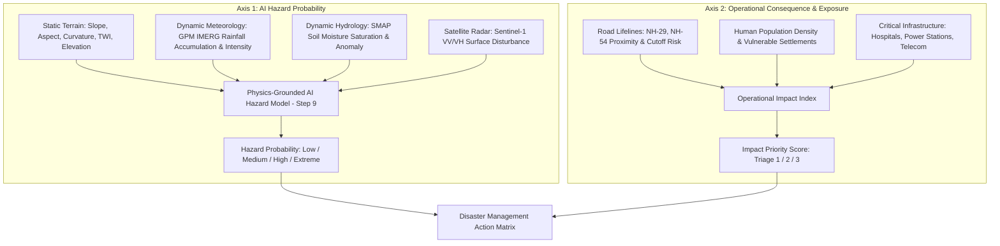

# STEP 8 — Feature Engineering & Unified Risk Dataset Schema

## 1. Executive Summary

This document establishes the official data dictionary, feature engineering definitions, resolution mappings, and anti-fabrication constraints for **STEP 8: Unified Feature Dataset** within the **NER Safe** platform.

The unified dataset is located at [`data/ml/feature_dataset.csv`](file:///c:/Users/sambi/Downloads/SIH%2026/data/ml/feature_dataset.csv) and contains **16,961 rows** (matching the regional 500 m risk grid for Kohima and Aizawl) across **54 standardized columns**.

---

## 2. Fundamental Architectural Principles

### 2.1 Strict Conceptual Separation: Hazard vs. Exposure

> [!IMPORTANT]
> **Scientific Separation of Cause and Consequence**
> Transportation infrastructure, population density, and municipal assets do **not** cause landslides. Landslides are triggered by physical shear stress exceeding shear strength (driven by gravity, slope geometry, soil hydrology, and rainfall pore-water pressure).
> 
> Therefore, the NER Safe model architecture separates risk into two distinct axes:
> 1. **AI HAZARD PROBABILITY ($P_{\text{hazard}}$)**:
>    Derived exclusively from static terrain morphometry and dynamic environmental drivers (rainfall, soil moisture, SAR surface disturbance).
> 2. **OPERATIONAL IMPACT PRIORITY ($I_{\text{priority}}$)**:
>    Derived from exposure assets (population, arterial highways, hospitals, bridges) to determine triage and emergency response dispatch.
> 
> The system **never** combines these into a single misleading "physical probability".



---

### 2.2 Spatial Resolution Hierarchy (Grid Scale vs. Sensor Measurement)

The analytical grid cell size of **500 m × 500 m** is an administrative and computational aggregation unit. It does **not** confer 500 m native measurement resolution to the underlying remote sensing instruments.

| Data Layer | Primary Data Source | Native Sensor / Model Resolution | Aggregation Method to 500 m Grid |
| :--- | :--- | :--- | :--- |
| **Grid Boundary** | District GIS Boundary Surveys | Metric vector polygon ($250,000\text{ m}^2$) | Native cell definition |
| **Terrain** | Copernicus DEM GLO-30 (ESA) | 30 m × 30 m (1.0 arc-sec) | Zonal mean / min / max (~278 pixels/cell) |
| **Rainfall** | NASA GPM IMERG V07B Half-Hourly | 0.1° × 0.1° (~10 km × 10 km) | Spatial overlay of regional gridded cell |
| **Soil Moisture** | NASA SMAP Enhanced L3 Radiometer | 9 km × 9 km (EASE-Grid 2.0) | Spatial overlay of regional gridded cell |
| **SAR Change** | Copernicus Sentinel-1 IW GRD | 20 m × 22 m (~10 m pixel spacing) | Zonal mean across terrain-corrected pixels |
| **Exposure** | OpenStreetMap / State PWD GIS | Vector lines and polygons | Proximity distance and zonal count |

---

### 2.3 Scientific Ground-Truth Target Labeling (Anti-False-Negative Rule)

In observational landslide inventories, records document **events that occurred and were reported** (presence-only data).
- A grid cell without a reported historical disaster is **NOT** confirmed to be stable or incapable of failure; it may simply be unpopulated, unmonitored, or forested.
- **Rule**: Cells without surveyed confirmation are marked as `UNLABELED` (`landslide_label = ""` / empty).
- `landslide_label = 1`: Confirmed historical event verified by GSI / NSDMA / DDMA.
- `landslide_label = 0`: Only assigned if an official geomorphic survey certifies a site as a validated stable baseline control zone (currently 0 to avoid false assumptions).

---

## 3. Comprehensive Feature Dictionary

The 54 columns of [`data/ml/feature_dataset.csv`](file:///c:/Users/sambi/Downloads/SIH%2026/data/ml/feature_dataset.csv) are documented below:

### 3.1 Spatial & Temporal Index

| Feature Name | Type | Units | Source | Description |
| :--- | :--- | :--- | :--- | :--- |
| `cell_id` | String | Format: `KOH_*` / `AIZ_*` | State Boundary GIS | Unique 500 m risk-grid cell identifier. |
| `district` | String | Categorical | Official Administration | District jurisdiction (`Kohima` or `Aizawl`). |
| `state` | String | Categorical | Survey of India | State jurisdiction (`Nagaland` or `Mizoram`). |
| `latitude` | Float | Decimal degrees | Spatial Centroid | WGS 84 centroid latitude of the 500 m cell. |
| `longitude` | Float | Decimal degrees | Spatial Centroid | WGS 84 centroid longitude of the 500 m cell. |
| `observation_date` | String | ISO 8601 (`YYYY-MM-DD`) | Pipeline Index | Reference snapshot or historical event date. |

---

### 3.2 Physical Hazard: Static Terrain Morphometry (Copernicus DEM 30m)

All terrain features were derived in **STEP 6** using Horn (1981) and Zevenbergen & Thorne (1987) algorithms in metric UTM Zone 46N (EPSG:32646):

| Feature Name | Type | Units | Range | Description |
| :--- | :--- | :--- | :--- | :--- |
| `elevation_mean` | Float | Meters (m) | $0 - 4000$ | Arithmetic mean topographic elevation within cell. |
| `elevation_min` | Float | Meters (m) | $0 - 4000$ | Lowest elevation point inside cell. |
| `elevation_max` | Float | Meters (m) | $0 - 4000$ | Highest elevation point inside cell (relief proxy). |
| `slope_mean` | Float | Degrees (°) | $0 - 90$ | Mean slope inclination angle. Primary conditioning factor. |
| `slope_max` | Float | Degrees (°) | $0 - 90$ | Steepest slope segment inside cell. |
| `aspect_mean` | Float | Degrees (°) | $0 - 360$ ($-1$ flat) | Circular mean slope orientation (compass direction). |
| `curvature_mean`| Float | $100 \times \text{m}^{-1}$| $-500$ to $+500$ | Surface profile curvature (+ ridge convex, - valley concave). |
| `twi_mean` | Float | Dimensionless | $-5$ to $+35$ | Topographic Wetness Index: $\ln(a / \tan \beta)$ hydrological accumulation. |

*Status: **AVAILABLE** (14,066 cells populated with full 30 m DEM statistics; border cells at boundary buffer marked NoData).*

---

### 3.3 Physical Hazard: Dynamic Meteorology (NASA GPM IMERG)

Dynamic precipitation metrics capturing intensity, short-term accumulation, and antecedent saturation:

| Feature Name | Type | Units | Source | Description |
| :--- | :--- | :--- | :--- | :--- |
| `rainfall_rate` | Float | $\text{mm}/\text{h}$ | GPM 3IMERGHH | Instantaneous precipitation rate at observation time. |
| `rainfall_30min` | Float | $\text{mm}$ | GPM 3IMERGHH | Half-hourly calibrated precipitation accumulation. |
| `rainfall_3h` | Float | $\text{mm}$ | GPM Rolling Sum | 3-hour cumulative burst precipitation. |
| `rainfall_6h` | Float | $\text{mm}$ | GPM Rolling Sum | 6-hour cumulative storm accumulation. |
| `rainfall_24h` | Float | $\text{mm}$ | GPM Daily Sum | 24-hour total precipitation (standard IMD threshold). |
| `rainfall_72h` | Float | $\text{mm}$ | GPM 3-Day Sum | 72-hour antecedent storm volume. |
| `rainfall_intensity`| Float | $\text{mm}/\text{h}$ | GPM Ratio | Peak rainfall intensity over storm window. |
| `rainfall_duration_h`| Float | Hours | GPM Continuous | Continuous precipitation duration above $1.0\text{ mm/h}$. |
| `antecedent_rainfall_7d`| Float | $\text{mm}$ | GPM Weekly Sum | 7-day cumulative antecedent rainfall driving pore pressure. |

*Status: **UNAVAILABLE_EARTHDATA_AUTH_REQUIRED** (Schema ready; values preserved as empty string rather than synthetic numbers).*

---

### 3.4 Physical Hazard: Dynamic Hydrology (NASA SMAP 9km)

Root-zone and surface soil dielectric moisture tracking:

| Feature Name | Type | Units | Source | Description |
| :--- | :--- | :--- | :--- | :--- |
| `soil_moisture_current` | Float | $\text{m}^3/\text{m}^3$ | SMAP SPL3SMP_E | Volumetric soil moisture at observation window ($0.0 - 0.6$). |
| `soil_moisture_previous`| Float | $\text{m}^3/\text{m}^3$ | SMAP Antecedent | Volumetric soil moisture 24–48 hours prior. |
| `soil_moisture_change` | Float | $\text{m}^3/\text{m}^3$ | Differential | Absolute moisture change: $\text{SM}_t - \text{SM}_{t-1}$. |
| `soil_moisture_change_percent`| Float | $\%$ | Relative Change | Percentage saturation increase towards liquid limit. |

*Status: **UNAVAILABLE_EARTHDATA_AUTH_REQUIRED** (Schema ready; values preserved as empty string).*

---

### 3.5 Physical Hazard: Satellite Remote Sensing (Copernicus Sentinel-1 C-SAR)

Multi-polarization radar backscatter change derived in **STEP 7**:

| Feature Name | Type | Units | Source | Description |
| :--- | :--- | :--- | :--- | :--- |
| `vv_change_db` | Float | Decibels (dB) | Sentinel-1 IW GRDH | Zonal mean VV backscatter change between 12-day repeat passes. |
| `vh_change_db` | Float | Decibels (dB) | Sentinel-1 IW GRDH | Zonal mean VH volume scattering change (canopy loss proxy). |
| `vv_vh_change` | Float | Decibels (dB) | Multi-Pol Euclidean | Combined anomaly magnitude: $\sqrt{(\Delta\text{VV})^2 + (\Delta\text{VH})^2}$. |
| `change_confidence` | Float | Index $[0.0, 1.0]$ | Sigmoidal Scaling | Normalized anomaly intensity index centered at 3.0 dB. |

*Status: **PENDING_REAL_SCENE_INGESTION** (Schema ready; values preserved as empty string).*

---

### 3.6 Physical Hazard: Environmental Context (Vegetation & Flood)

| Feature Name | Type | Units | Source | Description |
| :--- | :--- | :--- | :--- | :--- |
| `vegetation_ndvi` | Float | Index $[-1.0, 1.0]$ | Sentinel-2 / Landsat | Normalized Difference Vegetation Index (canopy health). |
| `flood_indicator` | Float | Index $[0.0, 1.0]$ | Surface Water Model | Drainage basin flood/inundation susceptibility flag. |

*Status: **UNAVAILABLE_PENDING_INGESTION** (Interface ready; values preserved as empty string).*

---

### 3.7 Exposure & Operational Consequence (Impact Prioritization)

| Feature Name | Type | Units | Source | Description |
| :--- | :--- | :--- | :--- | :--- |
| `road_proximity_m` | Float | Meters (m) | Highway GIS / OSM | Distance from cell centroid to nearest national/state highway. |
| `road_exposure_level` | String | Categorical | Highway Hierarchy | Exposure class (`HIGHWAY_NH29`, `ARTERIAL`, `RURAL`, `NONE`). |
| `population_density_est`| Float | $\text{persons}/\text{km}^2$| Census / WorldPop | Estimated local human population density. |
| `critical_infrastructure_count`| Integer| Count | Municipal GIS | Count of hospitals, electrical substations, bridges, schools. |
| `impact_priority_score`| Float | Index $[0.0, 100.0]$ | Weighted Asset Index| Operational triage score for emergency dispatch. |

*Status: **UNAVAILABLE_PENDING_INGESTION** (Interface ready; values preserved as empty string).*

---

### 3.8 Human Verification & Field Reports

| Feature Name | Type | Units | Source | Description |
| :--- | :--- | :--- | :--- | :--- |
| `citizen_report_count` | Integer| Count | Mobile Crowdsource | Verified citizen hazard reports lodged for cell. |
| `officer_verification_status`| String| Categorical | Disaster Official | Status: `VERIFIED`, `REJECTED`, `UNVERIFIED`. |
| `verification_timestamp`| String | ISO 8601 UTC | Field Device | Timestamp of officer physical inspection. |
| `verification_confidence`| Float | Index $[0.0, 1.0]$ | Expert Rating | Confidence score of field ground inspection. |

*Status: **UNVERIFIED** (Default baseline state).*

---

### 3.9 Historical Ground Truth Target Labels

| Feature Name | Type | Values | Description |
| :--- | :--- | :--- | :--- |
| `landslide_label` | Integer/Empty | `1`, `0`, `""` | Target variable: `1` = Confirmed Landslide; `0` = Confirmed Non-Landslide; `""` = Unlabeled. |
| `historical_event_id` | String | Event ID | GSI/NSDMA event code (e.g. `LS_KOH_2024_001`). |
| `event_location_name` | String | Location | Georeferenced sector name (e.g. `Dzudza Bridge (NH-29)`). |
| `label_quality` | String | Categorical | `VERIFIED_HISTORICAL`, `CONFIRMED_NEGATIVE`, `UNLABELED`. |

---

### 3.10 Explicit Data Status Flags

To guarantee zero silent zero-imputation:

| Status Flag Column | Expected Valid States |
| :--- | :--- |
| `terrain_status` | `AVAILABLE`, `NODATA_TERRAIN_BORDER` |
| `rainfall_status` | `AVAILABLE`, `UNAVAILABLE_EARTHDATA_AUTH_REQUIRED` |
| `soil_moisture_status` | `AVAILABLE`, `UNAVAILABLE_EARTHDATA_AUTH_REQUIRED` |
| `satellite_status` | `AVAILABLE`, `PENDING_REAL_SCENE_INGESTION` |
| `flood_status` | `AVAILABLE`, `UNAVAILABLE_PENDING_INGESTION` |
| `vegetation_status` | `AVAILABLE`, `UNAVAILABLE_PENDING_INGESTION` |
| `exposure_status` | `AVAILABLE`, `UNAVAILABLE_PENDING_INGESTION` |
| `verification_status` | `VERIFIED`, `UNVERIFIED` |

---

## 4. Execution & Validation Commands

### Build or Refresh Feature Dataset:
```bash
python scripts/build_feature_dataset.py
```

### Validate Feature Dataset Integrity:
```bash
python scripts/validate_feature_dataset.py
```
