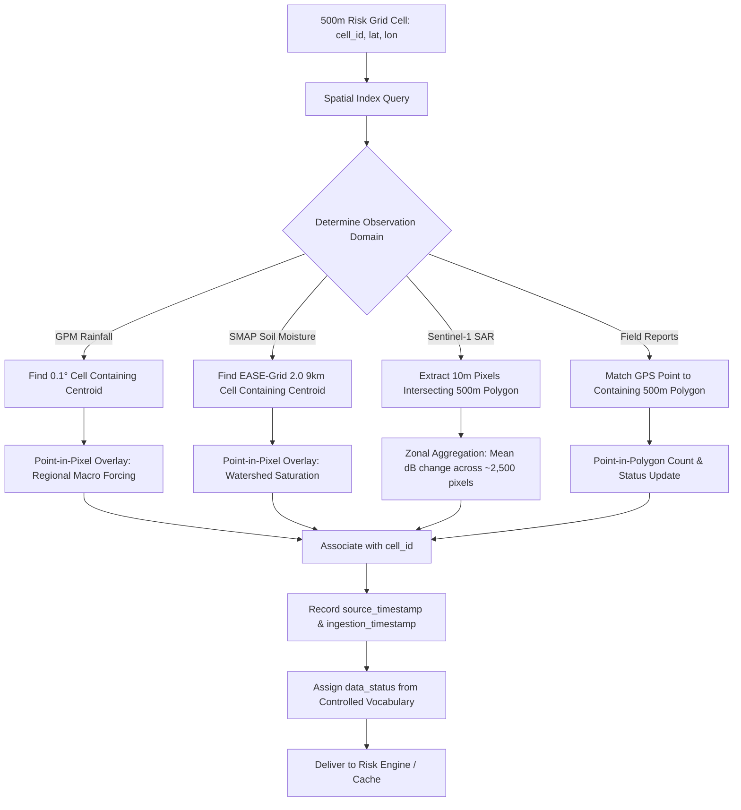

# STEP 9B — Dynamic Data Ingestion Interfaces & Observation Schema

**NER Safe (SIH 2026) — AI-Based Early Warning and Landslide Risk Monitoring System**  
**Pilot Focus:** Kohima District (Nagaland) & Aizawl District (Mizoram)  
**Status:** Task 3 Completed — Dynamic Ingestion Interface Specification  

---

## 1. Overview & Architectural Purpose

This specification establishes the **canonical data ingestion contract** for all external environmental observations entering the NER Safe platform. 

The analytical core of NER Safe operates on a standardized **500 m × 500 m spatial analysis grid** (6,055 cells in Kohima, 10,906 cells in Aizawl; 16,961 total cells). When real external observations (satellite, meteorological, radar, hydrological, mobile crowdsource) become available, the ingestion engine must map them into this grid through clean, auditable, and scientifically transparent interfaces without data distortion.

> [!IMPORTANT]
> **Data Contract Objective**  
> We are **not** downloading live data in this step. This document defines the rigid schema, validation rules, controlled vocabularies, and spatial mapping logic that any future ingestion worker or backend service must satisfy.

---

## 2. Canonical Dynamic Observation Record Schema

Every discrete environmental observation ingested into the system must conform to the following base record contract:

### 2.1 Core Base Observation Attributes

| Field Name | Type | Constraint | Description | Example |
| :--- | :--- | :--- | :--- | :--- |
| `observation_id` | String | Unique, Non-null | Unique identifier for the observation record | `OBS_GPM_20240818_0430_KOH_01378` |
| `cell_id` | String | Matches `KOH_*` or `AIZ_*` | Target 500 m grid cell identifier | `KOH_01378` |
| `district` | String | `Kohima` or `Aizawl` | District administrative jurisdiction | `Kohima` |
| `latitude` | Float | Decimal Degrees [22.0, 27.0] | Centroid latitude of the 500 m cell (WGS 84) | `25.688500` |
| `longitude` | Float | Decimal Degrees [91.0, 96.0] | Centroid longitude of the 500 m cell (WGS 84) | `94.027000` |
| `observation_timestamp` | String / Null | ISO 8601 UTC or `null` | Exact sensor acquisition / capture timestamp | `2024-08-18T04:30:00Z` |
| `source` | String | Non-null | Authoritative provider or instrument network | `NASA / JAXA GPM Constellation` |
| `source_product` | String | Non-null | Specific dataset or product identifier | `GPM_3IMERGHH_V07B` |
| `source_resolution` | String | Non-null | Native instrument resolution note | `0.1° (~10 km) Half-Hourly` |
| `value` | Float / Null | Numeric when populated; `null` if unpopulated | Primary measurement value | `18.4` (or `null`) |
| `unit` | String | Non-null standard unit | Measurement unit | `mm` |
| `data_status` | String | Controlled Vocabulary | Quality and freshness state flag | `AVAILABLE` |
| `source_timestamp` | String / Null | ISO 8601 UTC or `null` | Remote archive publication/granule timestamp | `2024-08-18T08:15:22Z` |
| `ingestion_timestamp` | String | ISO 8601 UTC | Timestamp when NER Safe ingested the record | `2024-08-18T08:20:01Z` |
| `quality_flag` | String | Controlled Flag | Instrument QC flag or retrieval confidence | `GOOD_RETRIEVAL` |

---

## 3. Multi-Variable Feature Domain Specifications

For environmental processes with multiple related indicators, the observation payload maps directly into the verified column names in [`data/ml/feature_dataset.csv`](file:///c:/Users/sambi/Downloads/SIH%2026/data/ml/feature_dataset.csv):

### 3.1 Meteorological Rainfall (`source_product: "GPM_3IMERGHH"`)

| Feature Field Name | Type | Unit | Valid Physical Range | Aggregation / Temporal Window |
| :--- | :---: | :---: | :---: | :--- |
| `rainfall_rate` | Float / Null | $\text{mm/h}$ | $[0.0, 300.0]$ | Instantaneous precipitation rate at observation time |
| `rainfall_30min` | Float / Null | $\text{mm}$ | $[0.0, 150.0]$ | Half-hourly calibrated precipitation accumulation |
| `rainfall_3h` | Float / Null | $\text{mm}$ | $[0.0, 450.0]$ | 3-hour rolling cumulative precipitation burst |
| `rainfall_6h` | Float / Null | $\text{mm}$ | $[0.0, 600.0]$ | 6-hour rolling cumulative storm accumulation |
| `rainfall_24h` | Float / Null | $\text{mm}$ | $[0.0, 1000.0]$ | 24-hour total daily precipitation |
| `rainfall_72h` | Float / Null | $\text{mm}$ | $[0.0, 2000.0]$ | 72-hour antecedent storm volume |
| `rainfall_duration_h` | Float / Null | Hours | $[0.0, 168.0]$ | Continuous duration with rainfall $> 1.0\text{ mm/h}$ |
| `antecedent_rainfall_7d` | Float / Null | $\text{mm}$ | $[0.0, 3000.0]$ | 7-day antecedent rainfall driving pore pressure |

### 3.2 Hydrological Soil Moisture (`source_product: "SPL3SMP_E"`)

| Feature Field Name | Type | Unit | Valid Physical Range | Aggregation / Temporal Window |
| :--- | :---: | :---: | :---: | :--- |
| `soil_moisture_current` | Float / Null | $\text{m}^3/\text{m}^3$ | $[0.02, 0.60]$ | Volumetric soil water content at current pass |
| `soil_moisture_previous` | Float / Null | $\text{m}^3/\text{m}^3$ | $[0.02, 0.60]$ | Volumetric soil water content 24–48h prior |
| `soil_moisture_change` | Float / Null | $\text{m}^3/\text{m}^3$ | $[-0.58, +0.58]$ | Absolute change: $\text{SM}_t - \text{SM}_{t-1}$ |
| `soil_moisture_change_percent`| Float / Null | $\%$ | $[-100.0, +500.0]$ | Relative saturation increase towards liquid limit |

### 3.3 Satellite SAR Radar Change (`source_product: "SENTINEL1_IW_GRD"`)

| Feature Field Name | Type | Unit | Valid Physical Range | Aggregation / Processing Note |
| :--- | :---: | :---: | :---: | :--- |
| `vv_change_db` | Float / Null | $\text{dB}$ | $[-25.0, +25.0]$ | Zonal mean VV backscatter change between repeat passes |
| `vh_change_db` | Float / Null | $\text{dB}$ | $[-25.0, +25.0]$ | Zonal mean VH volume scattering change (canopy loss proxy) |
| `vv_vh_change` | Float / Null | $\text{dB}$ | $[0.0, 40.0]$ | Euclidean magnitude: $\sqrt{(\Delta\text{VV})^2 + (\Delta\text{VH})^2}$ |
| `change_confidence` | Float / Null | $[0.0, 1.0]$ | $[0.0, 1.0]$ | Sigmoidal surface anomaly confidence score |

### 3.4 Drainage Basin Flood Inundation Context

| Feature Field Name | Type | Unit | Valid Physical Range | Aggregation / Processing Note |
| :--- | :---: | :---: | :---: | :--- |
| `flood_indicator` | Float / Null | $[0.0, 1.0]$ | $[0.0, 1.0]$ | Catchment/valley-bottom drainage flood susceptibility flag |

### 3.5 Human & Officer Field Verification

| Feature Field Name | Type | Unit / Values | Description |
| :--- | :---: | :---: | :--- |
| `citizen_report_count` | Integer / Null | $\ge 0$ | Verified crowdsourced citizen reports logged for cell |
| `verification_timestamp` | String / Null | ISO 8601 UTC | Timestamp of official field inspection |
| `verification_confidence` | Float / Null | $[0.0, 1.0]$ | Expert rating of field inspection credibility |
| `officer_verification_status`| String | `UNVERIFIED` / `VERIFIED` / `REJECTED` | Official on-site inspection outcome |

---

## 4. Spatial Mapping Architecture & Rules

The ingestion engine enforces a rigorous spatial association pipeline to map coarse or fine remote observations into the 500 m analysis grid:



### Spatial Mapping Constraints:
1. **Never Claim 500 m Sensor Resolution:**  
   - GPM IMERG ($0.1^\circ \approx 10\text{ km}$) covers approximately 400 analysis cells. All 400 cells inherit the identical macro-precipitation forcing value.
   - SMAP ($9\text{ km}$) covers approximately 324 analysis cells. All 324 cells inherit the identical regional watershed saturation value.
   - Sentinel-1 SAR provides sub-cell pixels (~10 m pixel spacing, ~2,500 pixels per 500 m cell). The cell value is the zonal mean of terrain-corrected backscatter change.
2. **Strict Fallback Rule:**  
   If an observation footprint cannot be safely and deterministically mapped to a cell boundary (e.g., coordinate reprojection failure or corrupt raster metadata), the cell value **must remain null/empty**. Under no circumstances may values be interpolated, guessed, or assigned from arbitrary neighbors.

---

## 5. Controlled Data Status Vocabulary

To eliminate ambiguity between "measurement is zero" and "data is missing", every dynamic observation must use one of the following strict status values:

| Status Value | Meaning | Permissible Values | Operational Action |
| :--- | :--- | :--- | :--- |
| `AVAILABLE` | Valid observation successfully retrieved and quality-verified within nominal latency window. | Numeric valid value | Process in dynamic risk engine. |
| `STALE` | Observation exists but its age exceeds the product's valid operational lifetime (e.g., GPM $> 12\text{h}$, SMAP $> 48\text{h}$, Sentinel-1 $> 30\text{d}$). | Numeric valid value + age flag | Flag as stale; use with degraded confidence; display age warning on UI. |
| `MISSING` | Source feed is active but no observation exists for this coordinate/timestamp (e.g., sensor swath gap, orbit gap). | `null` | Exclude from dynamic trigger; rely on static susceptibility baseline. |
| `REQUIRES_EXTERNAL_AUTH` | Ingestion pipeline requires credentials (e.g., NASA Earthdata Login, ESA Copernicus Hub) that are unconfigured or expired. | `null` | Display admin credential alert; strictly prohibit fake mock data. |
| `QUALITY_REJECTED` | Raw observation failed physical sanity checks (e.g., precipitation $< 0$, soil moisture $> 0.60$, corrupt granule checksum). | `null` | Discard bad reading; log telemetry anomaly alert. |
| `NOT_YET_IMPLEMENTED` | Ingestion pipeline connector for this layer is not yet deployed in the codebase. | `null` | Await implementation of layer connector. |

---

## 6. Strict Terminology Protocol: "Latest Available" vs. "Real-Time"

The platform enforces precise terminology across all UI dashboards, API responses, and technical documentation:

| Domain | Permissible Operational Terminology | Prohibited Misleading Terms |
| :--- | :--- | :--- |
| **GPM IMERG Early Run** | **"Near-real-time precipitation"** (nominal latency: ~4 hours) | *"Live rainfall", "Real-time downpour"* |
| **SMAP Soil Moisture** | **"Latest available daily soil moisture"** | *"Real-time soil saturation", "Live moisture"* |
| **Sentinel-1 SAR** | **"Latest available satellite observation"** (12-day orbital pass) | *"Real-time radar", "Live satellite view"* |
| **Offline / Cached Data** | **"Cached / last synchronized data"** (accompanied by sync timestamp) | *"Current conditions", "Real-time alerts"* |

---

## 7. Prohibition of Fabricated / Synthetic Fallback Data

> [!CAUTION]
> **Zero Tolerance for Fake Fallback Observations**  
> If an external feed is unavailable, expired, or rejected, the system must **strictly return**:
> ```json
> {
>   "value": null,
>   "data_status": "REQUIRES_EXTERNAL_AUTH",
>   "source": "NASA GPM IMERG V07B",
>   "observation_timestamp": null,
>   "message": "Observation unavailable pending NASA Earthdata authentication."
> }
> ```
> 
> The system must **NEVER** replace missing observations with:
> - Hardcoded constants (e.g., `0.0`, `25.0`, `0.5`)
> - Randomly sampled numbers
> - Regional or annual averages
> - Heuristically fabricated precipitation or moisture percentages
> - Uncalibrated synthetic noise

---

## 8. Summary of Data Contracts by Layer

```
+-------------------+----------------------+-------------------+-----------------------+
| Ingestion Layer   | Native Scale         | Update Frequency  | Ingestion Status Flag |
+-------------------+----------------------+-------------------+-----------------------+
| GPM Rainfall      | 0.1° (~10 km)        | 30-min (~4h delay)| REQUIRES_EXTERNAL_AUTH|
| SMAP Hydrology    | 9 km EASE-Grid 2.0   | Daily (AM pass)   | REQUIRES_EXTERNAL_AUTH|
| Sentinel-1 SAR    | ~10m pixel (20x22m)  | 12-day orbital    | REQUIRES_EXTERNAL_AUTH|
| DEM Morphometry   | 30m GLO-30           | Time-invariant    | AVAILABLE             |
| Flood Context     | Drainage Catchments  | Seasonal / Event  | UNAVAILABLE           |
| Human Inspection  | Point GPS            | Asynchronous      | PARTIALLY_AVAILABLE   |
| Exposure Assets   | Vector GIS           | Annual / Semi-stat| UNAVAILABLE           |
+-------------------+----------------------+-------------------+-----------------------+
```

---
*Generated: STEP 9B Task 3 — NER Safe SIH 2026 Project*  
*Data Ingestion Contract & Schema Specification*
