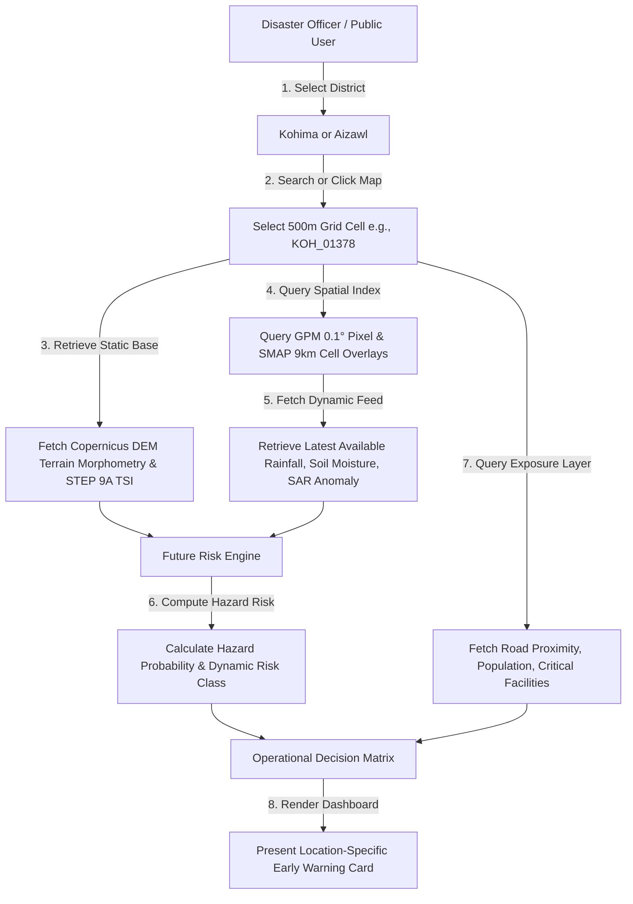

# STEP 9B — Dynamic Data Readiness & Location-Specific Risk Design

**NER Safe (SIH 2026) — AI-Based Early Warning and Landslide Risk Monitoring System**  
**Pilot Focus:** Kohima District (Nagaland) & Aizawl District (Mizoram)  
**Status:** Task 2 Completed — Dynamic Data Readiness & Workflow Specification  

---

## 1. Executive Summary

This document establishes the **location-specific dynamic data readiness specification** for the NER Safe early warning platform following the completion of the STEP 9A baseline susceptibility layer and the STEP 9B Task 1 programmatic audit ([`data/ml/dynamic_risk_readiness_audit.json`](file:///c:/Users/sambi/Downloads/SIH%2026/data/ml/dynamic_risk_readiness_audit.json)).

The primary goal of STEP 9B is to prepare the project architecture so that, when real external observations become accessible, the system can compute and present **location-specific, latest-available / near-real-time landslide risk** for any selected 500 m grid cell across Kohima (6,055 cells) and Aizawl (10,906 cells).

> [!IMPORTANT]
> **Strict Scientific Terminology: "Latest Available" vs. "Real-Time"**  
> The NER Safe platform strictly avoids characterizing the entire monitoring system as "real-time". Different environmental sensors operate on fundamentally different orbital revisit cycles, temporal latencies, and spatial resolutions:
> - **GPM IMERG precipitation** updates at half-hourly intervals with approximately 4 hours of Early Run latency.
> - **SMAP soil moisture** updates once daily (approx. 9 km resolution).
> - **Sentinel-1 C-SAR radar** updates on a 12-day orbital repeat pass cycle, providing episodic surface deformation evidence rather than continuous streams.
> - **Copernicus DEM terrain morphometry** is time-invariant (static).
>
> Therefore, operational risk scores reflect the **latest available** observation window, tagged with exact acquisition timestamps and data age flags.

---

## 2. Comprehensive Data Availability & Readiness Audit

Derived from the programmatic audit ([`scripts/audit_dynamic_risk_readiness.py`](file:///c:/Users/sambi/Downloads/SIH%2026/scripts/audit_dynamic_risk_readiness.py)) across the unified 16,961-cell risk grid:

### 2.1 Summary Matrix

| Data Domain | Specific Features Audited | Status | Temporal Nature | Update Latency / Cadence | External Auth / Ingestion Barrier |
| :--- | :--- | :---: | :---: | :---: | :--- |
| **1. Rainfall** | `rainfall_rate`, `rainfall_30min`, `rainfall_3h`, `rainfall_6h`, `rainfall_24h`, `rainfall_72h`, `rainfall_duration_h`, `antecedent_rainfall_7d` | `REQUIRES_EXTERNAL_AUTH` | **DYNAMIC** | 30-min observations; ~4h Early Run latency | NASA Earthdata Login required for GPM 3IMERGHH HDF5 access |
| **2. Soil Moisture** | `soil_moisture_current`, `soil_moisture_previous`, `soil_moisture_change`, `soil_moisture_change_percent` | `REQUIRES_EXTERNAL_AUTH` | **DYNAMIC** | Daily composite (~06:00 AM local descending pass) | NASA Earthdata Login required for SMAP SPL3SMP_E HDF5 access |
| **3. Satellite Change** | `vv_change_db`, `vh_change_db`, `vv_vh_change`, `change_confidence` | `REQUIRES_EXTERNAL_AUTH` | **DYNAMIC** | 12-day orbital revisit (event-driven, not live) | ASF DAAC / Copernicus Open Access credentials; scene download (~1 GB/pair) |
| **4. Terrain** | `elevation` (mean/min/max), `slope` (mean/max), `aspect`, `curvature`, `TWI`, `terrain_susceptibility_score` | `AVAILABLE` | **STATIC** | Time-invariant geomorphological baseline | None (Fully derived from Copernicus DEM GLO-30; 14,066 valid cells) |
| **5. Flood Context** | `flood_indicator` | `UNAVAILABLE` | **DYNAMIC** | Event/monsoon-driven inundation | Drainage basin water body GIS ingestion pending |
| **6. Verification** | `citizen_report_count`, `verification_timestamp`, `verification_confidence`, `officer_verification_status` | `PARTIALLY_AVAILABLE` | **DYNAMIC** | Asynchronous incident submission | `officer_verification_status` populated with `UNVERIFIED`; mobile sync pipeline pending |
| **7. Exposure Assets**| `road_proximity_m`, `road_exposure_level`, `population_density_est`, `critical_infrastructure_count` | `UNAVAILABLE` | **STATIC** | Semi-static annual census / OSM updates | Highway GIS vector clipping and WorldPop raster overlay pending |
| **8. Settlement Layer**| `villages` | `NOT_YET_IMPLEMENTED` | **STATIC** | Boundary GIS updates | Schema column not yet instantiated in `feature_dataset.csv` |

---

## 3. Deep Dive by Observation Domain

### 3.1 Meteorological Rainfall (NASA GPM IMERG)
- **Sensor:** Dual-frequency Precipitation Radar (DPR) and GPM Microwave Imager (GMI), merged with multi-satellite constellation data.
- **Official Product:** `GPM_3IMERGHH` (Version 07B).
- **Native Spatial Resolution:** $0.1^\circ \times 0.1^\circ$ (~10 km $\times$ 10 km).
- **Temporal Frequency:** 30-minute intervals.
- **Latency:**
  - *Early Run:* ~4 hours (intended for disaster early-warning and near-real-time monitoring).
  - *Late Run:* ~14 hours (includes forward and backward morphing).
  - *Final Run:* ~3.5 months (calibrated with world ground-gauge networks; research baseline).
- **Current State:** Schema exists in [`data/ml/feature_dataset.csv`](file:///c:/Users/sambi/Downloads/SIH%2026/data/ml/feature_dataset.csv). All values remain strictly empty strings (`""`) to prevent uncalibrated synthetic biases. 0 populated cells. Status: `UNAVAILABLE_EARTHDATA_AUTH_REQUIRED`.

### 3.2 Hydrological Soil Moisture (NASA SMAP)
- **Sensor:** L-band (1.41 GHz) polarimetric radiometer.
- **Official Product:** `SPL3SMP_E` (Version 6, Enhanced 9 km EASE-Grid 2.0).
- **Native Spatial Resolution:** ~9 km $\times$ 9 km ($9008.06\text{ m} \times 9008.06\text{ m}$).
- **Temporal Frequency:** Daily global composite; morning overpass (~06:00 solar local time) provides optimal canopy-soil thermal equilibrium.
- **Physical Measure:** Volumetric soil water content in top 5 cm ($\text{m}^3/\text{m}^3$).
- **Current State:** 0 populated cells in risk grid. Status: `UNAVAILABLE_EARTHDATA_AUTH_REQUIRED`.

### 3.3 Satellite SAR Surface Deformation (Copernicus Sentinel-1)
- **Sensor:** C-band Synthetic Aperture Radar (SAR, 5.405 GHz).
- **Official Product:** Level-1 Interferometric Wide Swath Ground Range Detected (`IW GRDH`).
- **Native Spatial Resolution:** $20\text{ m} \times 22\text{ m}$ (~10 m pixel spacing).
- **Temporal Frequency:** 12-day repeat orbit (Sentinel-1A). **This is NOT a continuous live feed.**
- **Physical Role:** SAR backscatter changes ($\Delta\text{VV}$, $\Delta\text{VH}$) serve as corroborating surface disturbance evidence (scar exposure, vegetation loss), not stand-alone automatic trigger labels.
- **Current State:** ASF catalog searched (500 candidate scenes indexed in `sentinel1_catalog.json`). Cache manifest reports 0 processed scenes. All cells empty. Status: `PENDING_REAL_SCENE_INGESTION`.

### 3.4 Geomorphological Terrain (Copernicus DEM 30m)
- **Sensor:** TanDEM-X radar constellation; edited Copernicus DEM GLO-30.
- **Spatial Resolution:** 30 m $\times$ 30 m (1.0 arc-second).
- **Aggregation:** Zonal mean, min, and max derived across ~278 DEM pixels per 500 m risk-grid cell.
- **Current State:** **Fully operational.** 14,066 cells populated with valid slope, elevation, curvature, and TWI. 2,895 boundary cells correctly flagged as `NODATA_BORDER`.
- **Baseline Susceptibility:** STEP 9A heuristic multi-criteria Terrain Susceptibility Index (TSI) scores (17.45 – 89.57) and Positive-Unlabeled (PU) similarity metrics are fully populated across all 14,066 valid cells. Status: `AVAILABLE`.

### 3.5 Flood Inundation Context
- **Physical Role:** Identifies valley-bottom drainage corridors where hydrological accumulation can create compounding flash-flood and toeslope toe-erosion destabilization.
- **Current State:** Schema exists; 0 populated cells. Status: `UNAVAILABLE_PENDING_INGESTION`.

### 3.6 Human and Officer Verification
- **Physical Role:** Provides operational ground-truth corroboration. Citizen submissions flag localized creeping tension cracks; authorized disaster officers conduct physical validation.
- **Current State:** `officer_verification_status` is initialized to `UNVERIFIED` for 100% of cells (16,961/16,961), guaranteeing transparent auditability. Dynamic count and timestamp fields remain unpopulated. Status: `PARTIALLY_AVAILABLE`.

### 3.7 Exposure and Infrastructure Assets
- **Layers:** National highways (NH-29 in Kohima, NH-54 in Aizawl), state arterial routes, population density, critical municipal facilities (hospitals, substations, telecom hubs).
- **Current State:** Column definitions established; awaiting authoritative geospatial asset overlay. Status: `UNAVAILABLE_PENDING_INGESTION`.

---

## 4. Location-Specific 500 m Grid Operational Workflow

The NER Safe web dashboard enables district officials and disaster response teams to interact with high-resolution geolocated hazard predictions. The end-to-end execution flow for a selected location operates as follows:



### Step-by-Step Execution Lifecycle:

1. **Location Selection:**  
   The user searches for a settlement, landmark (e.g., *Dzudza Bridge, NH-29*), or clicks a 500 m grid cell on the interactive MapLibre map.
2. **Cell Index Association:**  
   The backend retrieves the cell record (e.g., `cell_id = KOH_01378`), obtaining centroid coordinates ($25.6885^\circ\text{N}, 94.0270^\circ\text{E}$) and administrative metadata.
3. **Static Baseline Retrieval:**  
   The system extracts the pre-computed static geomorphology:
   - Mean Slope: $33.8^\circ$
   - TWI: $5.82$
   - Curvature: $-0.28\text{ m}^{-1}$
   - STEP 9A Baseline TSI Score: $61.48$ (`MODERATE`)
   - Primary Contributors: *Slope (52%), TWI (22%), Curvature (15%), Relief (11%)*
4. **Dynamic Observation Ingestion (Spatial Association):**  
   The backend associates the cell with its intersecting regional sensor footprints:
   - GPM IMERG 0.1° cell: `GPM_0.1DEG_N25.65_E094.05`
   - SMAP 9 km cell: `EASE2_M09_R0459_C2935`
   - Sentinel-1 Cache: Orbit Track 121, latest repeat pair
5. **Hazard Calculation:**  
   When dynamic data is present, the risk engine combines static susceptibility with dynamic triggers (rainfall intensity-duration, soil saturation percentage, radar deformation anomaly).
6. **Separated Exposure Evaluation:**  
   The operational impact engine evaluates consequences (proximity to NH-29: $<50\text{ m}$, population density, critical bridge cutoff risk).
7. **Transparent Dashboard Display:**  
   The UI renders the complete diagnostic profile, explicitly displaying:
   - Dynamic Risk Class (`LOW`, `MODERATE`, `HIGH`, `VERY_HIGH`)
   - Detailed contributing factor breakdown
   - Sensor source attribution for each indicator
   - Individual observation timestamps and freshness age

---

## 5. Spatial Resolution Hierarchy: 500 m Grid vs. Sensor Footprints

> [!IMPORTANT]
> **The 500 m Grid is an Analysis & Display Unit, NOT Native Sensor Resolution.**  
> A critical failure mode in spatial hazard systems is pretending coarse macro-scale satellite pixels represent fine-grained point measurements. NER Safe explicitly documents the scale differences across the data pipeline:

```
+-----------------------------------------------------------------------------------+
| GPM IMERG Rainfall Grid Cell: ~10 km x 10 km (0.1°)                               |
| Covers ~400 analysis cells (20 x 20 grid)                                         |
|                                                                                   |
|   +---------------------------------------------------------------------------+   |
|   | SMAP Soil Moisture Grid Cell: ~9 km x 9 km (EASE-Grid 2.0)               |   |
|   | Covers ~324 analysis cells (18 x 18 grid)                                 |   |
|   |                                                                           |   |
|   |   +---------------------------------------+                               |   |
|   |   | NER Safe Analysis Grid Cell: 500m x 500m  |                               |   |
|   |   | Aggregates ~278 Copernicus DEM pixels |                               |   |
|   |   | Aggregates ~2,500 Sentinel-1 pixels   |                               |   |
|   |   +---------------------------------------+                               |   |
|   +---------------------------------------------------------------------------+   |
+-----------------------------------------------------------------------------------+
```

### Detailed Scale Characteristics:

| Sensor Layer | Native Measurement Resolution | Spatial Footprint vs. 500 m Cell | Physical Meaning in Pipeline |
| :--- | :--- | :--- | :--- |
| **Copernicus DEM** | 30 m $\times$ 30 m | **Sub-cell resolution:** ~278 DEM pixels per 500 m cell | Captures hillslope steepness, drainage convergence, and relief. |
| **Copernicus Sentinel-1 SAR** | 20 m $\times$ 22 m (~10 m pixel spacing) | **Sub-cell resolution:** ~2,500 SAR pixels per 500 m cell | Zonal mean backscatter change detects localized surface disturbance. |
| **NASA SMAP Radiometer** | 9 km $\times$ 9 km (EASE-Grid 2.0) | **Macro-scale footprint:** Covers ~324 cells ($18 \times 18$) | Regional antecedent watershed saturation; not a point piezometer. |
| **NASA GPM IMERG** | 0.1° $\times$ 0.1° (~10 km $\times$ 10 km) | **Macro-scale footprint:** Covers ~400 cells ($20 \times 20$) | Regional precipitation storm forcing; not a ridge-top raingauge. |
| **Future NISAR L/S-SAR** | 100 m soil moisture product (future) | **Intermediate footprint:** Covers ~25 pixels per 500 m cell | Future enhancement capability; does not alter current SMAP baseline. |

---

## 6. Offline & Low-Bandwidth Architecture

To ensure operational survival during severe monsoon storms when grid power and cellular communication networks in Nagaland and Mizoram frequently collapse, NER Safe enforces an **offline-first resilience architecture**:

### 6.1 Operational Connectivity States

```mermaid
stateDiagram-v2
    [*] --> ONLINE
    ONLINE --> LIMITED_CONNECTION: Bandwidth degrades (< 50 kbps)
    LIMITED_CONNECTION --> OFFLINE: Link down (0 kbps)
    OFFLINE --> LIMITED_CONNECTION: Link partially restored
    LIMITED_CONNECTION --> ONLINE: Full broadband restored

    state ONLINE {
        Fetch_Realtime: Poll latest available GPM / SMAP / SAR
        Render_Live: Display live risk badge with current timestamp
    }

    state LIMITED_CONNECTION {
        Delta_Payloads: Load lightweight delta JSON (coordinates + risk class only)
        Suppress_Rasters: Suppress heavy satellite tiles; render vector grid
    }

    state OFFLINE {
        Local_Cache: Serve IndexedDB / SQLite cached district data
        Warning_Banner: Display persistent "OFFLINE — Showing Last Available Data" banner
        Timestamp_Notice: Display exact observation timestamp and sync age
        Queue_Reports: Store citizen/officer hazard reports locally for later sync
    }
```



### 6.2 Strict Offline Truthfulness Protocol:
1. **Never Call Cached Data Real-Time:**  
   If the network disconnects, the UI must **never** claim that risk scores or observations are live. A persistent warning banner is rendered:
   ```
   [OFFLINE MODE] Showing last synchronized data from: 2024-08-18 04:30 UTC (Age: 32 hours ago)
   ```
2. **Local Field Report Queuing:**  
   Citizen reports and officer ground inspections recorded while offline are queued in browser `IndexedDB` or mobile SQLite storage. Upon reconnection, they are synchronized with the backend using exponential backoff and cryptographic event IDs.
3. **Pre-Cached Static Assets:**  
   The 500 m risk grid vector boundaries and STEP 9A baseline terrain susceptibility scores are stored client-side, ensuring foundational risk assessment functions without an active internet connection.

---

## 7. Known Data-Source Limitations & Audit Findings

The Task 1 audit confirms the following boundary conditions:

1. **Ground-Truth Label Imbalance:**  
   - Confirmed positive landslide cells: **11** (5 in Kohima, 6 in Aizawl).
   - Confirmed negative landslide cells: **0** (no official stable-slope surveys exist).
   - Unknown background cells: **16,950** (cannot be arbitrarily assumed negative).
2. **Zero Dynamic Environmental Data Populated:**  
   All 16 dynamic meteorological, hydrological, and radar features are currently unpopulated pending real NASA Earthdata credentials and SAR scene ingestion. They remain clean empty strings.
3. **Spatial Disparity of Remote Sensing:**  
   Rainfall (10 km) and soil moisture (9 km) represent macro-scale meteorological triggers, while slope failure occurs at 10–50 m scales. Sub-cell topographic amplification must be modeled via terrain morphometry.
4. **Boundary NoData:**  
   2,895 cells (17.07%) lying along the state/district boundary polygons lack complete DEM coverage and are explicitly classified as `NODATA_BORDER`.
5. **Exposure Schema Expansion:**  
   Vector road proximity and village settlement layers require GIS ingestion scripts before impact prioritization can be computed.

---

## 8. Verification & Next Steps

- **Audit Verification:** Completed via [`scripts/audit_dynamic_risk_readiness.py`](file:///c:/Users/sambi/Downloads/SIH%2026/scripts/audit_dynamic_risk_readiness.py).
- **Core Dataset Invariance:** Zero rows, labels, or features were altered during STEP 9B Tasks 1 and 2.
- **Next Stage:** Task 3 — Risk Engine Architecture Design ([`documentation/STEP_9B_RISK_ENGINE_DESIGN.md`](file:///c:/Users/sambi/Downloads/SIH%2026/documentation/STEP_9B_RISK_ENGINE_DESIGN.md)).

---
*Generated: STEP 9B Task 2 — NER Safe SIH 2026 Project*  
*Anti-Fabrication & Scientific Truthfulness Protocol: Active — Zero synthetic observations or fake negative labels generated.*
