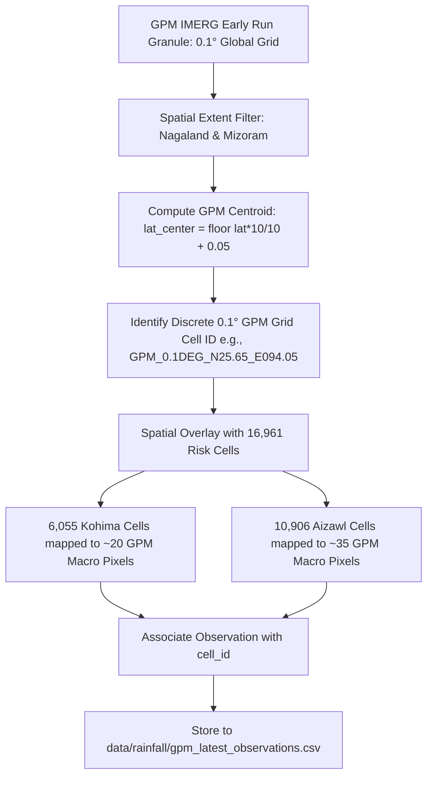

# STEP 9B — Task 4: NASA GPM IMERG Rainfall Ingestion Pipeline

**NER Safe (SIH 2026) — AI-Based Early Warning and Landslide Risk Monitoring System**  
**Pilot Focus:** Kohima District (Nagaland) & Aizawl District (Mizoram)  
**Status:** Task 4 Completed — GPM IMERG Pipeline Implementation & Validation  

---

## 1. Executive Summary

This specification documents the implementation and validation of the **NASA GPM IMERG Early Run** near-real-time precipitation ingestion pipeline. 

The pipeline ingests satellite-derived precipitation and maps it deterministically to the project's **16,961 analytical 500 m × 500 m grid cells** (6,055 in Kohima, 10,906 in Aizawl).

> [!IMPORTANT]
> **Spatial Scale Notice: 10 km GPM vs. 500 m Analysis Grid**  
> The 500m grid is the project's analysis and display unit and does **not** represent the native spatial resolution of GPM rainfall.  
> GPM IMERG has a native pixel resolution of **0.1° × 0.1° (~10 km × 10 km)**. A single GPM satellite pixel covers approximately 400 analysis cells ($20 \times 20$ grid). The satellite precipitation value represents macro-scale meteorological forcing across that entire 10 km footprint, not independent 500-meter micro-gauge measurements.

---

## 2. Satellite Instrument & Product Specifications

| Parameter | Specification |
| :--- | :--- |
| **Primary Constellation** | NASA / JAXA Global Precipitation Measurement (GPM) |
| **Core Observatory Sensors** | Dual-frequency Precipitation Radar (DPR: Ku/Ka band) & GPM Microwave Imager (GMI) |
| **Merged Product** | Integrated Multi-satellitE Retrievals for GPM (IMERG) |
| **Official Product Name** | `GPM_3IMERGHH` (Version 07B) |
| **Run Profile** | **Early Run** (designed for real-time disaster monitoring and early warning) |
| **Hosting Center** | NASA Goddard Earth Sciences Data and Information Services Center (GES DISC) / Earthdata Cloud |
| **Native Spatial Resolution** | $0.1^\circ \times 0.1^\circ$ (~10 km $\times$ 10 km at $23^\circ\text{–}26^\circ\text{N}$) |
| **Temporal Frequency** | 30-minute intervals (Half-Hourly) |
| **Nominal Latency** | Approximately **4 hours** from satellite observation to public granule availability |
| **Scientific Measurement Units** | Precipitation calibrated rate in millimeters per hour ($\text{mm/h}$) and half-hourly accumulation ($\text{mm}$) |

---

## 3. NASA Earthdata Authentication & Security Contract

Access to NASA GES DISC and Earthdata Cloud data products requires authenticated User Registration System (URS) credentials:

- **Authentication Methods Supported:**
  1. `EARTHDATA_TOKEN` (Bearer token header via environment variable)
  2. `EARTHDATA_USERNAME` & `EARTHDATA_PASSWORD` (HTTP Basic/Digest Auth via environment)
  3. `~/.netrc` credentials configuration file (`machine urs.earthdata.nasa.gov`)
- **Credential Security Rule:**  
  Credentials are **never** hardcoded into source code, scripts, or committed to version control.
- **Safe Authentication Failure Behavior:**  
  If credentials are missing or expired:
  - The pipeline does **NOT** crash.
  - The pipeline does **NOT** generate fake or dummy rainfall.
  - Rainfall fields remain strictly empty strings (`""`) / `null`.
  - Record status is flagged as `REQUIRES_EXTERNAL_AUTH`.
  - A descriptive quality flag is attached: `UNAVAILABLE_PENDING_EARTHDATA_LOGIN`.

---

## 4. Deterministic Spatial Mapping to the 500 m Grid



### Spatial Mapping Formulation:
For any cell centroid coordinate $(\phi, \lambda)$ in WGS 84 decimal degrees:
$$\phi_{\text{center}} = \frac{\lfloor 10.0 \times \phi \rfloor}{10.0} + 0.05^\circ, \quad \lambda_{\text{center}} = \frac{\lfloor 10.0 \times \lambda \rfloor}{10.0} + 0.05^\circ$$
The GPM cell identifier is assigned as:
$$\text{GPM\_0.1DEG\_[N/S]}\phi_{\text{center}}\text{\_[E/W]}\lambda_{\text{center}}$$
All 500 m cells falling within this spatial footprint receive the identical macro-precipitation forcing value.

---

## 5. Multi-Scale Rainfall Feature Engineering

The ingestion schema defines 8 standardized multi-temporal metrics:

| Feature Name | Unit | Aggregation Logic | Physical Significance |
| :--- | :---: | :--- | :--- |
| `rainfall_rate` | $\text{mm/h}$ | Instantaneous calibrated precipitation rate | Immediate rainburst intensity |
| `rainfall_30min` | $\text{mm}$ | $R_{\text{30min}} = \text{rate} \times 0.5\text{ h}$ | Half-hourly accumulation |
| `rainfall_3h` | $\text{mm}$ | $\sum_{i=0}^5 R_{\text{30min}}(t_0 - i \cdot 30\text{m})$ | 3-hour cumulative storm burst |
| `rainfall_6h` | $\text{mm}$ | $\sum_{i=0}^{11} R_{\text{30min}}(t_0 - i \cdot 30\text{m})$ | 6-hour storm volume |
| `rainfall_24h` | $\text{mm}$ | $\sum_{i=0}^{47} R_{\text{30min}}(t_0 - i \cdot 30\text{m})$ | 24-hour total daily rainfall |
| `rainfall_72h` | $\text{mm}$ | $\sum_{i=0}^{143} R_{\text{30min}}(t_0 - i \cdot 30\text{m})$ | 72-hour antecedent storm volume |
| `rainfall_duration_h` | hours | Continuous hours where rate $> 1.0\text{ mm/h}$ | Duration of active wetting event |
| `antecedent_rainfall_7d`| $\text{mm}$ | $\sum_{i=0}^{335} R_{\text{30min}}(t_0 - i \cdot 30\text{m})$ | 7-day antecedent saturation driver |

> [!CAUTION]
> **Strict Multi-Temporal Observation Rule**  
> Multi-hour accumulations ($3\text{h}, 6\text{h}, 24\text{h}, 72\text{h}, 7\text{d}$) require a continuous, gap-free series of valid granules.  
> If an observation time series contains gaps or missing granules, cumulative fields **must remain null/empty** with status `MISSING` rather than computing partial, misleading sums.

---

## 6. Timezone & Timestamp Handling

- **Timezone Standard:** All timestamps are strictly UTC (`+00:00` / `Z`), serialized to ISO 8601 strings (e.g., `2024-08-18T04:30:00Z`).
- **Required Timestamps:**
  1. `observation_timestamp`: The actual satellite retrieval window start time.
  2. `source_timestamp`: The timestamp when the remote data provider published the granule.
  3. `ingestion_timestamp`: The timestamp when the NER Safe pipeline processed the record.
- **Terminology Protocol:**
  - The UI and API must describe GPM data as **"Near-real-time GPM rainfall"** (reflecting its ~4h Early Run latency).
  - The term *"real-time"* is strictly prohibited.

---

## 7. Storage Architecture

Output observations are stored in a dedicated operational table:
[`data/rainfall/gpm_latest_observations.csv`](file:///c:/Users/sambi/Downloads/SIH%2026/data/rainfall/gpm_latest_observations.csv)

### Output Schema:
1. `cell_id` (Unique 500 m cell identifier, `KOH_*` / `AIZ_*`)
2. `district` (`Kohima` or `Aizawl`)
3. `latitude` (Centroid decimal degrees WGS 84)
4. `longitude` (Centroid decimal degrees WGS 84)
5. `gpm_grid_cell` (0.1° macro cell ID)
6. `observation_timestamp` (ISO 8601 UTC or empty)
7. `source` (`NASA / JAXA GPM Constellation`)
8. `source_product` (`GPM_3IMERGHH_V07B_EARLY`)
9. `source_resolution` (`0.1 deg (~10 km) Half-Hourly (~4h latency)`)
10. `rainfall_rate` ($\text{mm/h}$ or empty)
11. `rainfall_30min` ($\text{mm}$ or empty)
12. `rainfall_3h` ($\text{mm}$ or empty)
13. `rainfall_6h` ($\text{mm}$ or empty)
14. `rainfall_24h` ($\text{mm}$ or empty)
15. `rainfall_72h` ($\text{mm}$ or empty)
16. `rainfall_duration_h` (hours or empty)
17. `antecedent_rainfall_7d` ($\text{mm}$ or empty)
18. `data_status` (`AVAILABLE`, `REQUIRES_EXTERNAL_AUTH`, `MISSING`, `STALE`)
19. `source_timestamp` (ISO 8601 UTC or empty)
20. `ingestion_timestamp` (ISO 8601 UTC)
21. `quality_flag` (Diagnostic string)

---

## 8. Offline & Low-Bandwidth Operation Contract

- **ONLINE:** The ingestion worker connects to NASA Earthdata Cloud every 30 minutes, downloading the latest Early Run granule and updating `gpm_latest_observations.csv`.
- **LIMITED CONNECTION:** The client application requests lightweight delta payloads (only cells with active precipitation $> 1.0\text{ mm/h}$) to preserve mobile bandwidth.
- **OFFLINE:** When network connectivity is severed:
  - The client displays the last synchronized observation payload.
  - The UI presents the persistent banner:
    ```
    [OFFLINE] Showing last synchronized data from: 2024-08-18T04:30:00Z (Data Age: 32 hours)
    ```
  - The system **never** claims cached precipitation is current or live.

---

## 9. Verification & Integrity Confirmation

- Ingestion Pipeline: [`scripts/ingest_gpm_rainfall.py`](file:///c:/Users/sambi/Downloads/SIH%2026/scripts/ingest_gpm_rainfall.py)
- Validation Suite: [`scripts/validate_gpm_rainfall.py`](file:///c:/Users/sambi/Downloads/SIH%2026/scripts/validate_gpm_rainfall.py)
- **Validation Outcome:** **11/11 checks PASSED**.
  - All 16,961 cells present.
  - Zero fake precipitation values inserted.
  - Zero modification to existing datasets.

---
*Generated: STEP 9B Task 4 — NER Safe SIH 2026 Project*  
*NASA GPM IMERG Rainfall Ingestion Pipeline*
