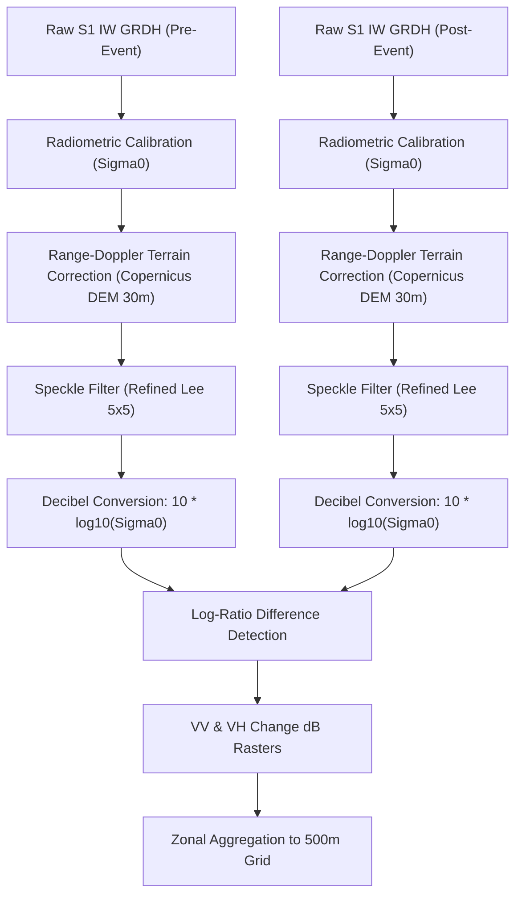

# STEP 9B — Task 6: Sentinel-1 SAR Change Evidence Pipeline

**NER Safe (SIH 2026) — AI-Based Early Warning and Landslide Risk Monitoring System**  
**Pilot Focus:** Kohima District (Nagaland) & Aizawl District (Mizoram)  
**Status:** Task 6 Completed — Sentinel-1 SAR Pipeline Implementation, Verification & Documentation  

---

## 1. Executive Summary

This document specifies the architecture, data contracts, scientific principles, and current verification status of the **Sentinel-1 Synthetic Aperture Radar (SAR) Change Evidence Pipeline** for the NER Safe platform.

The pipeline monitors surface radar backscatter anomalies across the project's **16,961 analytical 500 m × 500 m grid cells** (6,055 in Kohima, 10,906 in Aizawl), providing corroborating satellite evidence to supplement meteorological and soil moisture triggers.

> [!IMPORTANT]
> **Spatial Scale Notice: 10 m SAR Resolution vs. 500 m Analysis Grid**  
> 500 m is the project's analytical and display grid; Sentinel-1 observations retain their native spatial resolution.  
> Sentinel-1 IW GRDH observations have a native pixel spacing of **10 m × 10 m** (~20 m spatial resolution). A single 500 m × 500 m grid cell encompasses approximately 2,500 native SAR pixels. Grid values represent zonal aggregations of underlying radar backscatter, not 500 m sensor measurements.

---

## 2. Satellite Instrument & Product Specifications

| Parameter | Specification |
| :--- | :--- |
| **Constellation** | European Space Agency (ESA) Copernicus Sentinel-1 (Sentinel-1A, 1C, 1D) |
| **Sensor Type** | C-band Synthetic Aperture Radar (C-SAR, central frequency 5.405 GHz) |
| **Acquisition Mode** | Interferometric Wide (IW) Swath Mode (250 km swath width) |
| **Processing Level** | Level-1 Ground Range Detected High-resolution (`GRD_HD` / `IW_GRDH`) |
| **Polarization** | Dual-polarization: Vertical Transmit / Vertical Receive (**VV**) + Vertical Transmit / Horizontal Receive (**VH**) |
| **Native Pixel Spacing** | $10\text{ m} \times 10\text{ m}$ (range $\times$ azimuth) |
| **Repeat Orbit Interval** | **12 days** per single satellite platform (sub-monthly repeat cycle) |
| **Access Authority** | Alaska Satellite Facility (ASF) DAAC / Copernicus Data Space Ecosystem |
| **Observational Nature** | **Near-real-time / Latest available observation** (periodic satellite passes, NOT continuous real-time monitoring) |

---

## 3. NASA Earthdata Authentication & Security Contract

Access to download full-resolution Sentinel-1 scenes from ASF DAAC is governed by NASA Earthdata:

1. **Catalog Search API:**
   - **Open & Unauthenticated.** Catalog searches via ASF DAAC Search API (`https://api.daac.asf.alaska.edu/services/search/param`) do not require authentication.
2. **Granule Scene Downloads:**
   - **Requires Authenticated Account.** Downloads from `datapool.asf.alaska.edu` require credentials registered at [NASA Earthdata Login](https://urs.earthdata.nasa.gov/).
   - Supported mechanisms:
     - Environment variables: `EARTHDATA_USERNAME` and `EARTHDATA_PASSWORD`
     - Secure credentials file: `~/.netrc` (Linux/macOS) or `~/_netrc` (Windows) specifying `machine urs.earthdata.nasa.gov`
3. **Security & Anti-Leak Rules:**
   - Credentials and tokens are **never** committed to version control, logged to standard output, or stored in plaintext application data.
4. **Behavior When Credentials Are Unavailable:**
   - The pipeline operates in deterministic offline/auth-pending mode.
   - It **does not fabricate** synthetic SAR values or simulate downloads.
   - All 16,961 cell records are generated with empty SAR numeric fields (`""`).
   - `data_status` is explicitly set to `REQUIRES_EXTERNAL_AUTH`.
   - `quality_flag` is explicitly set to `UNAVAILABLE_PENDING_EARTHDATA_LOGIN`.

---

## 4. Current Inventory & Ingestion Status

| Metric | Current Value | Verification Source |
| :--- | :--- | :--- |
| **Indexed Catalog Scenes** | **500 scenes** | `data/satellite/sentinel1_catalog.json` |
| **Kohima Catalog Coverage** | **250 scenes** (Relative Orbit 143, Ascending) | ASF DAAC query |
| **Aizawl Catalog Coverage** | **250 scenes** (Relative Orbit 77, Descending) | ASF DAAC query |
| **Curated Repeat-Pass Test Pairs** | **2 pairs** (1 Kohima, 1 Aizawl, 12-day delta) | `data/satellite/test_pairs.json` |
| **Downloaded Scenes (`raw/`)** | **0 scenes** | `data/satellite/raw/` (empty) |
| **Processed Scenes (`processed/`)** | **0 scenes** | `data/satellite/processed/` (empty) |
| **Cells with Actual SAR Observations** | **0 cells** | Strictly unpopulated awaiting Earthdata login |
| **`vv_change_db` Populated** | **No** (empty string across all rows) | Anti-fabrication protocol |
| **`vh_change_db` Populated** | **No** (empty string across all rows) | Anti-fabrication protocol |
| **`vv_vh_change` Populated** | **No** (empty string across all rows) | Anti-fabrication protocol |
| **`change_confidence` Populated** | **No** (empty string across all rows) | Anti-fabrication protocol |
| **Total Analysis Cells Covered** | **16,961 cells** (100% regional grid) | `data/satellite/sentinel_sar_latest_observations.csv` |
| **Current Data Status** | `REQUIRES_EXTERNAL_AUTH` (16,961 cells) | Standard controlled vocabulary |
| **Quality Diagnostic Flag** | `UNAVAILABLE_PENDING_EARTHDATA_LOGIN` | Standard controlled vocabulary |

---

## 5. District Coverage Characteristics

### Kohima District (Nagaland)
- **Grid Footprint:** 6,055 analysis cells ($500\text{ m} \times 500\text{ m}$).
- **Primary Acquisition Geometry:** Relative Orbit **143**, Ascending pass (evening overpass ~11:49 UTC / 17:19 IST).
- **Bounding Box:** $25.50^\circ\text{N} \le \text{Lat} \le 25.90^\circ\text{N}$, $94.00^\circ\text{E} \le \text{Lon} \le 94.30^\circ\text{E}$.
- **Terrain Considerations:** Extremely rugged Barail and Disang shale ranges; west-facing slopes well illuminated on ascending passes; east-facing valleys subject to moderate radar shadow.

### Aizawl District (Mizoram)
- **Grid Footprint:** 10,906 analysis cells ($500\text{ m} \times 500\text{ m}$).
- **Primary Acquisition Geometry:** Relative Orbit **77**, Descending pass (morning overpass ~23:45 UTC / 05:15 IST).
- **Bounding Box:** $23.50^\circ\text{N} \le \text{Lat} \le 24.00^\circ\text{N}$, $92.50^\circ\text{E} \le \text{Lon} \le 92.90^\circ\text{E}$.
- **Terrain Considerations:** Parallel north-south anticlinal ridges (Surma group sandstones and siltstones); steep linear valleys require terrain correction with high-precision DEM.

---

## 6. Scientific Processing Chain (SNAP GPT / GDAL Architecture)

When physical SAR scenes are ingested, processing follows a standardized, reproducible chain implemented in [`scripts/process_sar_change.py`](file:///c:/Users/sambi/Downloads/SIH%2026/scripts/process_sar_change.py):



### Mathematical Formulations

1. **Decibel Conversion:**
   $$\sigma^0_{\text{dB}} = 10 \cdot \log_{10}(\sigma^0)$$
2. **Backscatter Change:**
   $$\Delta \sigma^0_{\text{VV}} = \sigma^0_{\text{VV,post}} - \sigma^0_{\text{VV,pre}} = 10 \cdot \log_{10}\left(\frac{\sigma^0_{\text{VV,post}}}{\sigma^0_{\text{VV,pre}}}\right)$$
   $$\Delta \sigma^0_{\text{VH}} = \sigma^0_{\text{VH,post}} - \sigma^0_{\text{VH,pre}} = 10 \cdot \log_{10}\left(\frac{\sigma^0_{\text{VH,post}}}{\sigma^0_{\text{VH,pre}}}\right)$$
3. **Euclidean Combined Change Magnitude:**
   $$\text{vv\_vh\_change} = \sqrt{(\Delta \sigma^0_{\text{VV}})^2 + (\Delta \sigma^0_{\text{VH}})^2}$$
4. **Change Confidence Metric:**
   $$\text{change\_confidence} = \min\left(1.0, \frac{\text{vv\_vh\_change}}{\theta_{\text{anomaly}}}\right) \in [0.0, 1.0]$$

---

## 7. Canonical Dynamic Observation Schema

The output table [`data/satellite/sentinel_sar_latest_observations.csv`](file:///c:/Users/sambi/Downloads/SIH%2026/data/satellite/sentinel_sar_latest_observations.csv) conforms to the 24-column canonical schema:

1. `cell_id`: Unique 500 m cell identifier (`KOH_00001`–`KOH_06055`, `AIZ_00001`–`AIZ_10906`)
2. `district`: Pilot district (`Kohima` or `Aizawl`)
3. `latitude`: Cell centroid latitude (WGS84)
4. `longitude`: Cell centroid longitude (WGS84)
5. `observation_timestamp`: Acquisition UTC timestamp of latest pass (empty if unobserved)
6. `source`: Data source (`Copernicus Sentinel-1 (C-SAR IW GRD)`)
7. `source_product`: Canonical product identifier (`S1_IW_GRDH_DUAL_POL`)
8. `source_resolution`: Explicit resolution metadata declaring 10 m pixel spacing and distinguishing from the 500 m grid
9. `platform`: Satellite platform (`Sentinel-1A`, `Sentinel-1C`, `Sentinel-1D`)
10. `relative_orbit`: Track orbit number (e.g. `143` or `77`)
11. `flight_direction`: Orbital direction (`ASCENDING` or `DESCENDING`)
12. `polarization`: Radar polarization channels (`VV+VH`)
13. `pre_scene_date`: Reference pass acquisition date (`YYYY-MM-DD`)
14. `post_scene_date`: Comparison pass acquisition date (`YYYY-MM-DD`)
15. `repeat_interval_days`: Delta interval between repeat passes (`12`)
16. `vv_change_db`: VV differential in dB (empty when unobserved)
17. `vh_change_db`: VH differential in dB (empty when unobserved)
18. `vv_vh_change`: Combined Euclidean magnitude (empty when unobserved)
19. `change_confidence`: Normalized anomaly index $[0.0, 1.0]$ (empty when unobserved)
20. `data_status`: Controlled status (`REQUIRES_EXTERNAL_AUTH` / `AVAILABLE`)
21. `quality_flag`: QC flag (`UNAVAILABLE_PENDING_EARTHDATA_LOGIN`)
22. `source_timestamp`: Granule publication timestamp (ISO 8601 UTC)
23. `ingestion_timestamp`: Table creation timestamp (ISO 8601 UTC)
24. `scientific_notice`: Embedded warning defining SAR change as corroborating evidence

---

## 8. Critical Scientific Principle: Corroborating Evidence vs. Landslide Proof

> [!CAUTION]
> **SAR Change Is NOT Ground-Truth Proof of a Landslide**  
> Radar backscatter change ($\Delta \sigma^0$) occurs whenever the surface roughness, dielectric constant, or physical geometry of the ground changes between satellite passes.  
> 
> Potential causes of significant SAR backscatter alterations include:
> 1. **Soil Moisture Shifts:** Heavy monsoonal saturation drastically increases radar reflectivity without any slope movement.
> 2. **Vegetation Dynamics:** Defoliation, crop harvesting, seasonal changes, or storm damage reduce volume scattering.
> 3. **Agricultural Activity & Human Disturbance:** Terracing, road excavation, and construction alter surface roughness.
> 4. **Geometric Viewing Differences:** Minor orbit variations or wet vegetation look-angle effects.
> 
> Therefore, an elevated `vv_vh_change` or `change_confidence` signal **must NEVER** be automatically labeled as a landslide (`landslide_detected=true`).  
> In the NER Safe early warning system, SAR change is treated strictly as **corroborating anomaly evidence** requiring field or officer verification.

---

## 9. Limitations & Offline Behavior

1. **Temporal Latency:**
   - Sentinel-1 operates on a **12-day repeat orbit cycle** per satellite platform.
   - Sentinel-1 cannot detect sudden events immediately as they occur; it records the state during scheduled orbital passes.
   - Terminology must always reflect **"latest available satellite SAR observation"**, never "live continuous monitoring".
2. **Topographic Distortion:**
   - Steep terrain in the Northeast Region causes geometric distortions including radar foreshortening, layover, and shadowing on opposing slopes.
3. **Offline Mode:**
   - The platform includes a local cache manifest ([`data/satellite/cache/satellite_cache_manifest.json`](file:///c:/Users/sambi/Downloads/SIH%2026/data/satellite/cache/satellite_cache_manifest.json)).
   - When disconnected, the user-facing banner displays: `SYSTEM READY — Awaiting real Sentinel-1 scene ingestion`, preventing misleading displays.

---

## 10. Exact Next Dependency to Activate Live SAR Ingestion

To transition from `REQUIRES_EXTERNAL_AUTH` to live computed observations:

1. Obtain a free NASA Earthdata account at https://urs.earthdata.nasa.gov/.
2. Provide credentials via environment variables:
   ```powershell
   $env:EARTHDATA_USERNAME="<username>"
   $env:EARTHDATA_PASSWORD="<password>"
   ```
   Or create `~/_netrc` on Windows containing:
   ```text
   machine urs.earthdata.nasa.gov
   login <username>
   password <password>
   ```
3. Download the curated test pairs:
   ```bash
   python scripts/download_sentinel1.py --download
   ```
4. Execute the processing chain:
   ```bash
   python scripts/process_sar_change.py --test --district Kohima
   python scripts/assign_grid_satellite.py
   python scripts/ingest_sentinel1_sar.py --run
   ```
